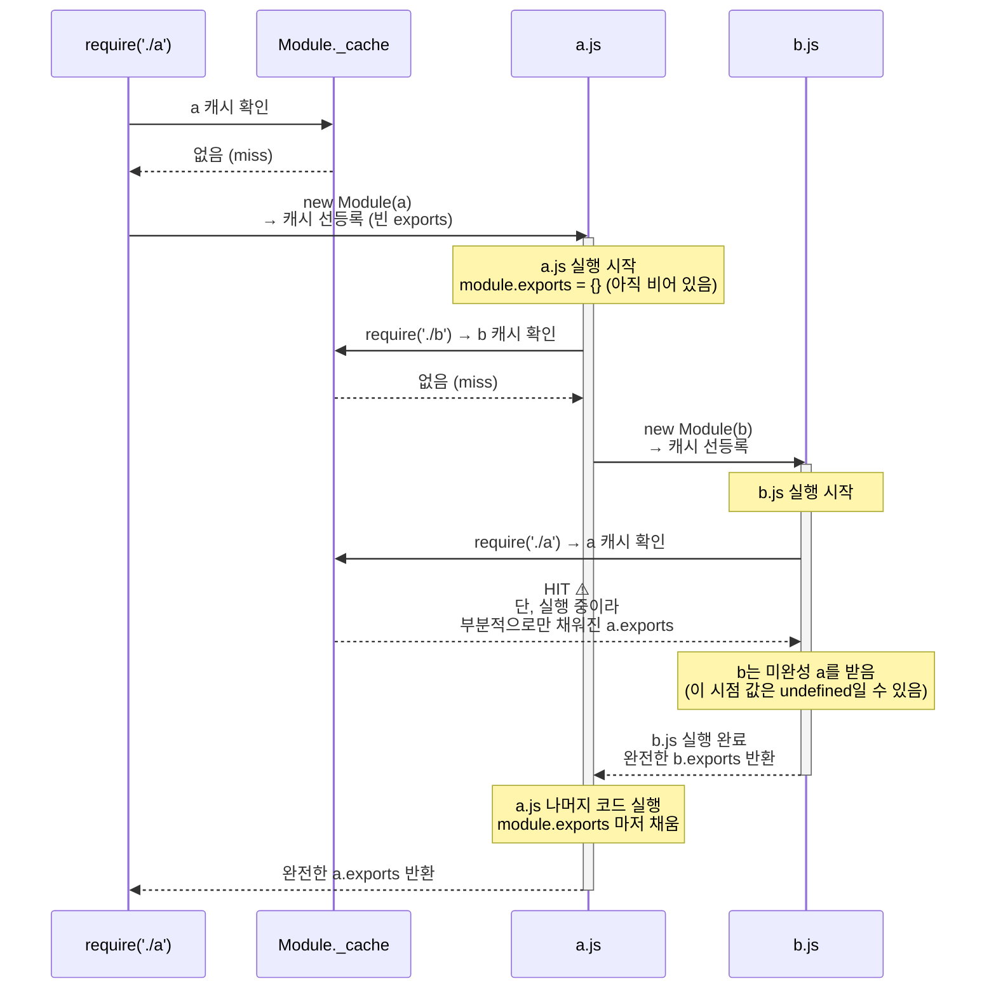

## 들어가며

브라우저에서 Javascript 를 쓸 때는 그저 `<script>` 태그로 파일을 순서대로 불러오는 게 전부였다.  
하지만 서버에서 NodeJS 를 기반으로 Javascript 를 쓰려면 얘기가 달라진다.  
수백 개의 파일이 서로를 참조해야 하는 상황에서 스크립트 태그로 순서를 맞추는 방식은 현실적이지 않다.  
이를 해결하려면 파일 간 의존성을 명시적으로 선언하고 불러올 수 있는 모듈 시스템이 필요하다.  

### CommonJS

CommonJS (CJS) 는 NodeJS 에서 이러한 문제를 해결하기 위해 2009년에 만들어진 모듈 명세다.  
Node.js 는 이 명세를 채택해 `require()` / `module.exports` 를 핵심 API 로 구현했고,  
현재도 Node.js 생태계의 상당 부분이 CJS 기반으로 동작한다. (점차 ESM 으로 가는 추세긴 하지만)  

```javascript
// foo.js
const x = 10; // 지역 변수 → 외부에서 접근 불가

module.exports = {
  value: x,
  double: (n) => n * 2,
};
```

```javascript
// bar.js
const foo = require('./foo');
foo.value;     // 10
foo.double(5); // 10
// x 는 접근 불가 (foo.js 의 지역 변수)
```

`require()` 는 대상 파일을 실행한 뒤, 그 파일이 `module.exports` 에 담아놓은 값을 반환한다.  
이번 글에서는 이 두 줄이 작동하기 위해 내부적으로 무슨 일이 벌어지는지 단계별로 파헤친다.  

---

## Module 클래스

> Node.js 의 CJS 모듈 시스템은 `Module` 이라는 내장 클래스를 중심으로 돌아간다.  

`require()` 로 로드된 모든 JS 파일은 이 클래스의 인스턴스로 만들어진다.  
Module 클래스는 파일의 경로, exports 값, 로드 상태 등 모듈의 메타 정보를 담는 컨테이너 역할을 한다.  

실제 Node.js 소스에서 Module 생성자는 아래와 같이 생겼다.  

```javascript
// lib/internal/modules/cjs/loader.js
function Module(id = '', parent) {
  this.id       = id;               // 모듈 식별자 (보통 파일 절대경로)
  this.path     = path.dirname(id); // 이 모듈의 디렉토리 경로
  this.exports  = {};               // require() 가 반환하는 값 (초기값: 빈 객체)
  this.filename = null;             // 파일 절대경로 (load 후 채워짐)
  this.loaded   = false;            // 로드 완료 여부
  this.children = [];               // 이 모듈이 require 한 모듈 목록
}
```

Module 클래스는 두 가지 역할을 동시에 한다.  

- **인스턴스** — 각 파일의 정보를 나타내는 컨테이너. `require()` 가 호출될 때마다 하나씩 만들어진다.  
- **정적 메서드/프로퍼티** — CJS 모듈 시스템 전체를 제어하는 유틸리티. `createRequire`, `builtinModules`, `isBuiltin` 등이 여기에 속한다.  

정적 프로퍼티 중 핵심은 아래 두 가지다.  

```javascript
// lib/internal/modules/cjs/loader.js

Module._cache      = { __proto__: null }; // 로드된 모듈을 저장하는 프로세스 전역 캐시
Module._extensions = { __proto__: null }; // 확장자별 로더 (.js, .json, .node)
```

참고로 `{ __proto__: null }` 은 `Object.create(null)` 과 동일하다.  
프로토타입 체인이 없는 순수한 key-value 맵으로, `toString` 같은 Object 의 기본 프로퍼티와의 이름 충돌을 방지한다.  

---

## module 과 exports 는 어디서 오는가

CJS 로 코드를 작성할 때 우리는 아래 값들을 별도로 import 하지 않고 그냥 사용한다.  
외부에서 이를 별도로 가져오지 않았는데도 어떻게 가능한 걸까?  

```javascript
const path   = require('path');
const fs     = require('fs');
const CONFIG_PATH = path.join(__dirname, '../config.json');
const config = JSON.parse(fs.readFileSync(CONFIG_PATH, 'utf-8'));

module.exports = {
  get: (key) => config[key],
  path: __filename,
};
```

비밀은 Node.js 가 모든 JS 파일을 실행하기 전에 Module Wrapper 로 감싼다는 것이다.  
코드를 실행하기 전에 Wrapper Function 으로 감싸고 인자로 아래의 값들을 주입한다.  

```javascript
// lib/internal/modules/cjs/loader.js

const wrapper = [
  '(function (exports, require, module, __filename, __dirname) { ',
  '\n});',
];
```

그렇기에 실제 파일 코드는 이 Wrapper Function 안에 들어간 뒤 실행된다.  

```javascript
// 원본 파일 코드
const x = 10;
module.exports = { value: x };

// Node.js 가 실제로 실행하는 코드
(function (exports, require, module, __filename, __dirname) {
  const x = 10;
  module.exports = { value: x };
});
```

`module`, `exports`, `require`, `__filename`, `__dirname` 이 전역 변수처럼 느껴지는 이유는  
이 Wrapper 의 매개변수로 주입되기 때문이다. 실제로는 해당 파일 스코프에 갇힌 **지역 변수**다.  

인자로 주입되는 값을 정리하면 아래와 같다.  

| 매개변수 | 실제 값 | 설명 |
|---|---|---|
| `exports` | `module.exports` 의 초기값 `{}` | `module.exports` 의 별칭으로 시작 |
| `require` | `makeRequireFunction(module)` | 이 파일 기준의 모듈 탐색 함수 |
| `module` | `new Module(filename)` | 현재 파일의 Module 인스턴스 |
| `__filename` | `filename` | 파일 절대경로 |
| `__dirname` | `path.dirname(filename)` | 파일이 위치한 디렉토리 |

### exports 와 module.exports 의 관계

> `exports` 는 `module.exports` 를 가리키는 참조 (별칭) 로 시작한다.  

`module.exports` 는 Module 인스턴스의 프로퍼티로, `require` 함수가 최종적으로 반환하는 값이다.  
모듈이 외부로 공개하는 값에 대한 인터페이스 역할을 맡는다.  

처음에는 `exports === module.exports` 가 `true` 다. 따라서 프로퍼티를 추가하면 양쪽 모두에 반영된다.  

```javascript
exports.foo = 'bar';         // module.exports.foo === 'bar'
module.exports.baz = 'qux'; // exports.baz === 'qux'
```

그런데 `exports` 를 새 객체로 **재할당**하는 순간 참조가 끊긴다.  

```javascript
exports = { foo: 'bar' };        // ❌ module.exports 는 여전히 {}
module.exports = { foo: 'bar' }; // ✅ require() 가 { foo: 'bar' } 를 반환
```

`require()` 는 `exports` 가 아닌 **`module.exports`** 를 반환한다.  
그렇기에 모듈 내에서 외부로 공개할 값은 반드시 `module.exports` 에 할당해야 한다.  

---

## require 함수가 호출되면

`require(X)` 를 호출하면 내부적으로 `Module._load` 가 실행된다. 전체 흐름은 아래와 같다.  



이를 정리하면 `require()` 가 하는 일은 크게 세 가지로 나눌 수 있다.  

- **최초 호출 시** — 경로에 있는 파일을 읽고 `_compile` 을 통해 평가(evaluation)한다. 파일 안의 코드가 실제로 한 번 실행되고 `module.exports` 에 값이 채워진다.  
- **이후 동일 경로 호출 시** — 파일을 읽지 않고 `Module._cache` 에서 `module.exports` 를 꺼낸다. 이미 캐싱된 데이터를 반환하기에 파일을 다시 읽거나 실행하지 않는다.  
- **반환값** — 대상 모듈의 `module.exports` 프로퍼티에 할당된 값을 그대로 반환한다.  

---

## require 의 주요 프로퍼티

### require.cache

> `Module._load` 가 캐시를 확인하는 실체가 바로 이 프로퍼티다 (`Module._cache` 참조).  

- Key : 모듈의 절대경로 (string)  
- Value : 해당 모듈의 `Module` 인스턴스 (`id`, `exports`, `loaded` 등 포함)  

```javascript
require('./foo');
console.log(require.cache[require.resolve('./foo')]);
// Module { id: '...', exports: { ... }, loaded: true, ... }
```

한 가지 중요한 점은 `require()` 의 반환값이 캐시 항목의 `exports` 와 **동일한 메모리 참조**라는 점이다.  
복사본이 아니기 때문에, 캐시에서 꺼낸 객체를 수정하면 이후 모든 `require()` 호출에 영향을 미친다.  

```javascript
const foo = require('./foo');
foo === require.cache[require.resolve('./foo')].exports // true
```

만약 캐시 항목을 명시적으로 삭제하면 다음 `require()` 시 파일을 다시 읽는다.  
단, **기존에 이미 참조를 들고 있는 변수는 삭제 후에도 구버전 객체를 그대로 가리킨다. (GC 되지 않음)**  

```javascript
const old = require('./foo');

delete require.cache[require.resolve('./foo')];

const fresh = require('./foo'); // 새로 로드
old === fresh // false: old 는 여전히 구버전 객체를 참조
```

**왜 캐싱된 모듈 정보는 Node 프로세스 전역에서 공유되는가?**  

`makeRequireFunction` 내부에서 `require.cache = Module._cache` 로 바인딩하기 때문이다.  
`Module._cache` 는 프로세스 시작 시 딱 한 번 생성되기에,  
각 파일마다 `require` 인스턴스가 달라도 `_cache` 프로퍼티는 항상 동일한 객체를 가리킨다.  

---

### require.resolve(request)

> 모듈을 실제로 로드하지 않고 **탐색의 결과로 산출된 절대경로만 반환**한다.  

- 모듈 로드 없이 경로만 확인할 때 유용하다.  
- 탐색에 실패하면 `MODULE_NOT_FOUND` 에러를 던진다.  
- 코어 모듈은 파일 경로가 아닌 모듈명 그대로 반환한다.  

```javascript
require.resolve('./foo');    // '/absolute/path/to/foo.js'
require.resolve('express');  // '/project/node_modules/express/index.js'
require.resolve('node:fs');  // 'node:fs' (코어 모듈은 경로 없음)
```

---

### require.resolve.paths(request)

해당 모듈을 탐색할 때 존재 여부를 순서대로 확인하는 경로 목록을 반환한다.  

- 패키지가 어느 `node_modules` 에 존재하는지를 디버깅할 때 유용하다.  
- NodeJS Built-In 모듈은 별도의 탐색 경로가 없으므로 `null` 을 반환한다.  

```javascript
require.resolve.paths('express');
// [
//   '/project/src/node_modules',
//   '/project/node_modules',
//   '/node_modules',
//   ...
// ]

require.resolve.paths('node:fs'); // null
```

---

### require.main

프로세스의 진입점 모듈을 가리킨다.  

- `node entry.js` 처럼 직접 실행한 경우 `require.main === module` 이 `true` 다.  
- 다른 파일에서 `require('./entry')` 로 불러온 경우 `false` 다.  
- 진입점이 CommonJS 가 아닌 경우 `undefined` 를 반환한다.  

```javascript
// entry.js
if (require.main === module) {
  console.log('직접 실행됨');  // node entry.js
} else {
  console.log('require 됨');   // require('./entry')
}
```

---

### require.extensions (Deprecated v0.10.6+)

확장자별 로더를 등록하는 객체다.  

- `.js`, `.json`, `.node` 가 기본으로 등록되어 있다.  
- 공식 문서에서 직접 사용은 권장하지 않는다. (Deprecated 됨)  
- 다만 `ts-node` 같은 도구가 `.ts` 로더를 내부적으로 등록할 때 이 객체를 활용한다.  

```javascript
Object.keys(require.extensions) // ['.js', '.json', '.node']
```

---

## 모듈 탐색 알고리즘

> Node.js 공식 문서의 수도코드를 기준으로 실제 동작을 정리한다.  

`require()` 는 `'./foo'`, `'express'`, `'fs'` 처럼 다양한 형태의 문자열을 인자로 받는다.  
그런데 `Module._cache` 의 키는 항상 파일의 절대경로다.  
즉 Node.js 는 이 문자열을 실제 파일의 절대경로로 변환한 뒤에야 캐시를 확인하고 파일을 로드할 수 있다.  

이 변환을 담당하는 것이 `Module._resolveFilename` 이며, 그 내부 동작이 바로 탐색 알고리즘이다.  
NodeJS 에서는 인자로 받은 확장자의 형태에 따라 서로 다른 전략을 쓴다.  

- `'fs'`, `'path'` 같은 이름 → 내장 모듈 여부 확인  
- `'./foo'`, `'../config'` 처럼 `./` 로 시작 → 호출한 파일 기준 상대경로 해석  
- `'express'` 처럼 이름만 있는 경우 → `node_modules` 를 위로 올라가며 탐색  

### 탐색 전: 모듈 캐시 확인

`require(X)` 가 호출되면 `Module._load` 가 실행된다. 여기서 가장 먼저 하는 일은 **캐시 확인**이다.  

```javascript
const cachedModule = Module._cache[filename];
if (cachedModule !== undefined) {
  return cachedModule.exports; // 파일 탐색 없이 바로 반환
}
```

- 캐시 키는 **항상 절대경로**다.  
- symlink 를 해석한 실 경로를 사용한다. (macOS 에서 `/tmp` 가 `/private/tmp` 의 심볼릭 링크인 것처럼)  
- 따라서 실제 Module 캐시에 해당 모듈이 없을 때만 아래 탐색 알고리즘이 실행된다.  

### 전체 흐름 요약

1. **Core Module 확인** — `fs`, `path` 등 내장 모듈이면 즉시 반환  
2. **상대경로 처리** — `./`, `../`, `/` 로 시작하면 LOAD_AS_FILE → LOAD_AS_DIRECTORY  
3. **패키지 imports 확인** — `#` 로 시작하면 package.json `imports` 필드 탐색  
4. **self-reference 확인** — 현재 패키지 자신을 참조하는지 확인 (LOAD_PACKAGE_SELF)  
5. **node_modules 탐색** — 현재 위치에서 루트 방향으로 올라가며 탐색  
6. **실패** — 모든 경로에서 찾지 못하면 `MODULE_NOT_FOUND` 에러  

### Step 1 — Core Module

```javascript
require('fs')    // → 'fs' (파일 탐색 없음)
require('path')  // → 'path'
```

- `Module.builtinModules` 목록에 있으면 파일 탐색 자체를 건너뛰고 즉시 반환한다.  
- `node:` 접두사를 붙이면 `node_modules` 에 같은 이름 패키지가 있어도 무조건 내장 모듈을 반환한다.  
- 코어 모듈은 `require.cache` 를 거치지 않는다.  

### Step 2 — 상대경로 → LOAD_AS_FILE

require 함수의 인자로 받은 경로가 `./`, `../`, `/` 로 시작하는 경우다.  

```
require('./foo') 탐색 순서:
  1. foo       (확장자 그대로) → 없으면 계속
  2. foo.js    → 있으면 반환
  3. foo.json  → 있으면 반환
  4. foo.node  → 있으면 반환 (네이티브 바이너리)
  5. 없으면    → LOAD_AS_DIRECTORY(foo)
```

- 확장자를 명시 (`require('./foo.js')`) 하면 1번에서 바로 찾는다.  
- `.js` 파일을 찾을 때 package.json 의 `"type": "module"` 필드를 확인해 CJS/ESM 여부를 판단한다.  
- `.json` 은 `JSON.parse` 로 파싱해 객체로 반환한다.  
- `.node` 는 C++ 네이티브 애드온 바이너리로, `process.dlopen()` 으로 로드한다.  

### Step 3 — 디렉토리 → LOAD_AS_DIRECTORY

require 함수의 인자로 받은 경로가 파일이 아닌 디렉토리를 가리키는 경우다.  

```
require('./pkg')
  1. pkg/package.json 가 존재하는가?
     └─ "exports" 필드 있으면 → "main" 보다 우선 처리
     └─ "main" 필드 있으면   → LOAD_AS_FILE(pkg/main값)
  2. pkg/index.js   → 있으면 반환
  3. pkg/index.json → 있으면 반환
  4. pkg/index.node → 있으면 반환
```

- `package.json` 의 `"exports"` 필드가 `"main"` 보다 우선된다.  
- 이것이 바로 최신 패키지들이 `exports` 로 공개 API 를 명시하는 이유다.  
- `"main"` 이 없으면 `index.js` 를 자동으로 찾는다 (암묵적 규칙).  

### Step 4 — 패키지명 → LOAD_NODE_MODULES

인자로 받은 값이 경로가 아닌 `express`, `lodash` 같은 패키지 명인 경우다.  
패키지의 경우 **현재 파일 위치에서 루트 방향으로 올라가며** `node_modules` 를 탐색한다.  

실제 `Module._nodeModulePaths` 구현은 파일 경로를 역방향으로 순회하며  
경로 구분자(`/`)를 만날 때마다 `node_modules` 를 붙이는 방식이다.  
이미 `node_modules` 가 포함된 경로 구간은 건너뛰어 중첩을 방지한다.  

```
디렉토리 구조:
/project/
├── node_modules/
│   └── express/        ← ④ 여기서 발견
└── src/
    ├── node_modules/   ← ③ 없음
    └── utils/
        ├── node_modules/   ← ② 없음
        └── helper.js       ← require('express') 호출 위치

탐색 순서 (현재 위치 → 루트 방향):
  ② /project/src/utils/node_modules/express  ✗
  ③ /project/src/node_modules/express        ✗
  ④ /project/node_modules/express            ✓ 반환
     /node_modules/express                   (탐색 안 함)
```

`module.paths` 에 이 탐색 경로 목록이 담겨있다.  

```javascript
console.log(module.paths);
// [
//   '/project/src/utils/node_modules',
//   '/project/src/node_modules',
//   '/project/node_modules',
//   '/node_modules',
//   ...
// ]
```

이 구조 덕분에 모노레포에서 패키지마다 다른 버전의 의존성을 각자의 `node_modules` 에 격리할 수 있다.  
상위 `node_modules` 에서 공통 의존성을 호이스팅해서 중복 설치를 줄이는 것도 이를 활용한 것이다.  

---

## 탐색 실패 시

위 과정을 거쳐 모든 경로를 탐색해도 파일이 없으면 최종적으로 `MODULE_NOT_FOUND` 에러가 발생한다.  

```javascript
Error: Cannot find module 'foo'
Require stack:
- /project/src/utils/helper.js  ← 여기서 require('foo') 호출
- /project/src/index.js         ← 이 파일이 helper.js 를 require
```

- `requireStack` 을 보면 어떤 파일에서 시작된 탐색인지 추적할 수 있어 디버깅에 유용하다.  
- 경로 오타, 패키지 미설치, `node_modules` 위치 문제 등이 원인인 경우가 대부분이다.  

---

## 마치며

사실 `require` 는 그냥 어디선가에서 다른 파일을 가져오는 함수 정도로만 생각해왔는데, 들여다보니 생각보다 복잡한 시스템이었다.  

특히 Module Wrapper 가 전역 변수라는 오해를 종식시켜주면서 `require`, `__dirname` 을 파일마다 적절하게 주입해준다는 점, `exports` 와 `module.exports` 가 같은 것처럼 쉽게 쓰이지만 재할당 한 줄로 동작이 갈리는 구조는 모른다면 얼마든지 헤멜 수 있어 보인다.  

다음 글에서는 `require` 를 통해 불러온 파일이 어떻게 평가 및 실행되어 Module 에 적재되는지를 실제 Node.js 소스를 따라가며 분석해보고자 한다.  
