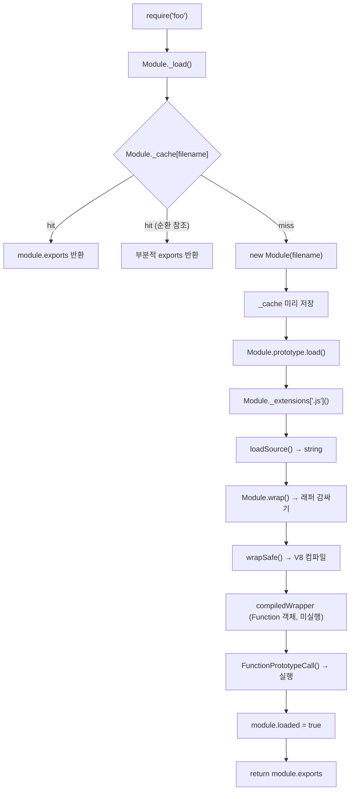

## 들어가며

이전 글에서는 `require()` 를 이해하기 위한 개념들을 정리했다.
Module 클래스, module/exports 의 출처, Module Wrapper, 탐색 알고리즘, require.cache 까지 설명했다.

그런데 정작 핵심이 되는 한 부분은 설명 없이 넘어갔다.

> 파일 코드가 실행되며 module.exports 에 값이 채워진다.

이 한 줄이 이전 글에서 블랙박스로 남긴 부분이다.
파일이 어떻게 읽히는지, 어떻게 컴파일되는지, 어떻게 실행되는지.
그리고 실행 결과가 어떻게 `module.exports` 에 담기는지는 설명하지 않았다.

이번 글에서는 그 블랙박스를 열어본다.
`require()` 호출부터 `module.exports` 반환까지, 실제 Node.js 소스를 단계별로 따라가며 파이프라인 전체를 분석한다.

전체 흐름을 먼저 보자.



각 단계를 실제 Node.js 소스 발췌와 함께 분석한다.

---

## Step 1 — Module._load: 진입점

`require('foo')` 를 호출하면 실제로는 `Module._load` 가 실행된다.

```javascript
// lib/internal/modules/cjs/loader.js
Module._load = function(request, parent, isMain) {
  // 1. 경로 탐색으로 절대경로 결정 (이전 글의 탐색 알고리즘)
  const filename = Module._resolveFilename(request, parent, isMain);

  // 2. 캐시 확인
  const cachedModule = Module._cache[filename];
  if (cachedModule !== undefined) {
    updateChildren(parent, cachedModule, true);
    if (cachedModule.loaded) {
      return cachedModule.exports; // 캐시 hit → 즉시 반환
    }
    // loaded 가 false = 순환 참조 상황 → 부분적 exports 반환
    return getExportsForCircularRequire(cachedModule);
  }

  // 3. Module 인스턴스 생성
  const module = new Module(filename, parent);

  // 4. 캐시에 미리 저장 ← 실행 전에 저장하는 게 핵심
  Module._cache[filename] = module;

  // 5. 파일 로드 및 실행
  let threw = true;
  try {
    module.load(filename);
    threw = false;
  } finally {
    if (threw) {
      delete Module._cache[filename];
    }
  }

  return module.exports;
};
```

눈에 띄는 게 두 가지 있다.

### 캐시를 실행 전에 미리 저장하는 이유

> 순환 참조(circular dependency) 때문이다.

```javascript
// a.js
exports.x = 1;             // (1) 여기까지 실행됨
const b = require('./b');  // (2) b.js 로딩 시작 → a.js 실행 일시 중단
exports.y = 2;             // (4) b.js 완료 후 재개
```

```javascript
// b.js
const a = require('./a');  // (3) a.js 는 캐시에 있지만 (1)까지만 실행된 상태
console.log(a.x);          // 1         ← exports.x 는 이미 할당됨
console.log(a.y);          // undefined ← exports.y 는 아직 실행되지 않음
```

`a.js` 실행 중에 `b.js` 가 `require('./a')` 를 호출하면, 캐시에 `a.js` 의 `Module` 인스턴스가 이미 있다.
`module.exports` 가 아직 완전히 채워지지 않은 상태(`loaded = false`)이지만,
무한 루프를 막기 위해 그 시점까지 채워진 `exports` 를 그대로 반환한다.

즉 **"부분적인 exports"** 란, `a.js` 가 `require('./b')` 를 호출한 시점까지 `module.exports` 에 할당된 값들이다.
그 아래 코드는 아직 실행되지 않았으므로 해당 값들은 `undefined` 로 보인다.

순환 참조가 생기면 어느 쪽을 먼저 require 하느냐에 따라 받는 값이 달라진다.
Node.js 공식 문서도 순환 의존이 생길 경우 늦게 참조(Lazy)하거나 구조를 재설계하길 권장하는 이유가 여기에 있다.

### try/finally 로 로드 실패 시 캐시를 정리하는 이유

파일 파싱 에러, 런타임 에러 등으로 로드가 실패했을 때 캐시에 불완전한 항목이 남을 수 있다.
이렇게 되면 이후 `require()` 호출이 에러 없이 잘못된 값을 반환할 수 있다.

그래서 `threw === true` 일 때 캐시를 지워 다음 `require()` 가 처음부터 다시 코드를 불러올 수 있게 한다.

---

## Step 2 — Module.prototype.load: 확장자 기반 로더 선택

Step 1 에서 `module.load(filename)` 을 호출하면 이 함수가 실행된다.
파일의 확장자를 보고 적절한 로더를 선택한다.

```javascript
// lib/internal/modules/cjs/loader.js
Module.prototype.load = function(filename) {
  assert(!this.loaded); // 이미 로드된 모듈을 다시 load() 하면 assertion 에러

  this.filename ??= filename;
  this.paths ??= Module._nodeModulePaths(path.dirname(filename));

  const extension = findLongestRegisteredExtension(filename); // '.js', '.json', '.node' 등
  Module._extensions[extension](this, filename); // 확장자별 로더 실행

  this.loaded = true; // ← 로더 실행이 완전히 끝난 후에야 true 로 바뀐다
};
```

로더(loader)는 파일을 읽어서 그 내용을 `module.exports` 에 채우는 함수다.
`Module._extensions` 는 확장자를 키로, 로더를 값으로 갖는 Map 으로 볼 수 있다.

```javascript
Module._extensions['.js']   = function(module, filename) { /* 포맷 감지 + loadSource + _compile */ };
Module._extensions['.json'] = function(module, filename) { /* loadSource + JSON.parse */ };
Module._extensions['.node'] = function(module, filename) { /* process.dlopen */ };
```

각 로더마다 `module.exports` 를 채우는 방식이 다르다.

- `.js` — 파일 코드 전체를 컴파일 후 실행. 실행 중 발생한 side effect 는 모두 적용되지만, `require()` 가 반환하는 것은 `module.exports` 에 할당된 값뿐이다.
- `.json` — 파일을 읽고 `JSON.parse` 한 뒤 `module.exports` 에 직접 할당
- `.node` — C++ 네이티브 바이너리를 `process.dlopen` 으로 로드

여기서 눈여겨 볼 점은 `this.loaded = true` 의 위치다.
`Module._extensions[extension](this, filename)` 이 반환된 뒤에야 `true` 가 된다.
즉, 파일 코드가 완전히 실행되기 전까지 `module.loaded` 는 항상 `false` 다.

순환 참조 감지가 `loaded === false` 를 기준으로 동작하는 이유가 여기에 있다.

---

## Step 3 — Module._extensions['.js']: 포맷 결정과 파일 읽기

`.js` 로더는 두 가지 일을 담당한다.
**CJS/ESM 포맷 결정**과 **파일 읽기 후 평가**다.

```javascript
// lib/internal/modules/cjs/loader.js
Module._extensions['.js'] = function(module, filename) {
  let format;

  if (StringPrototypeEndsWith(filename, '.cjs')) {
    format = 'commonjs';
  } else if (StringPrototypeEndsWith(filename, '.mjs')) {
    format = 'module';
  } else {
    // .js 파일은 가장 가까운 package.json 의 "type" 필드 확인
    const pkg = packageJsonReader.getNearestParentPackageJSON(filename);
    format = pkg?.data.type; // 'module' | 'commonjs' | undefined
  }

  const { source } = loadSource(module, filename, format);
  module._compile(source, filename, format);
};
```

`loadSource` 는 단순한 `fs.readFileSync` 가 아니다.
컴파일 캐시(`--compile-cache`) 확인, 로드 훅(load hook) 실행, 결과를 string 으로 정규화하는 과정까지 포함한다.

`.json` 로더는 다르게 동작한다.

```javascript
// lib/internal/modules/cjs/loader.js
Module._extensions['.json'] = function(module, filename) {
  const { source: content } = loadSource(module, filename, 'json');

  try {
    module.exports = JSON.parse(content); // _compile 없이 바로 module.exports 에 할당
  } catch (err) {
    err.message = filename + ': ' + err.message;
    throw err;
  }
};
```

`_compile` 을 거치지 않고 `module.exports` 를 직접 채운다.
Module Wrapper 감싸기, vm 컴파일, FunctionPrototypeCall 이 모두 생략된다.

---

## Step 4 — Module.wrap: string 결합

`module._compile(source, filename, format)` 이 호출되면 내부에서 `wrapSafe` 가 실행된다.
`wrapSafe` 는 `Module.wrap` 을 통해 파일 코드를 래퍼 함수 문자열로 감싼다.

구현 자체는 단순하다.

```javascript
// lib/internal/modules/cjs/loader.js
const wrapper = [
  '(function (exports, require, module, __filename, __dirname) { ',
  '\n});',
];

let wrap = function(script) {
  return Module.wrapper[0] + script + Module.wrapper[1];
};
```

`foo.js` 내용이 `module.exports = { value: 10 }` 한 줄이라면 결과는 이렇다.

```javascript
// wrap() 의 반환값 — 이 시점에서는 아직 그냥 문자열이다
'(function (exports, require, module, __filename, __dirname) { \nmodule.exports = { value: 10 }\n});'
```

왜 래퍼로 감싸는가, 이유는 두 가지다.

- **전역 오염 방지** — `var x = 1` 같은 최상위 변수가 `global` 에 붙지 않도록 파일 스코프를 격리한다.
- **변수 주입** — `exports`, `require`, `module`, `__filename`, `__dirname` 을 각 파일 고유의 지역 변수로 주입하기 위해 매개변수로 선언한다.

`Module.wrap` 은 사용자가 직접 교체할 수 있다.
`patched` 플래그가 이를 감지해 다음 단계(`wrapSafe`)의 내부 경로를 결정한다.

---

## Step 5 — wrapSafe: string → Function

감싼 문자열을 실제 **Function 객체**로 컴파일한다.
내부에 두 가지 경로가 있다.

```javascript
// lib/internal/modules/cjs/loader.js
function wrapSafe(filename, content, cjsModuleInstance, format) {
  if (patched) {
    // Module.wrap 이 사용자에 의해 교체된 경우
    const wrapped = Module.wrap(content);
    const script = makeContextifyScript(wrapped, filename, ...);
    return {
      function: runScriptInThisContext(script, true, false),
    };
  }

  // 일반 경우: V8 의 compileFunctionForCJSLoader 직접 호출 (더 최적화된 경로)
  const result = compileFunctionForCJSLoader(content, filename, false, shouldDetectModule);
  return result;
}
```

`compileFunctionForCJSLoader` 는 V8 의 네이티브 바인딩으로,
`Module.wrap` 의 문자열 결합 없이 직접 래퍼 함수를 컴파일한다.
`patched` 가 아닌 일반 경우에 사용되는 더 빠른 경로다.

**이 시점에서 코드는 아직 실행되지 않았다.**

```javascript
typeof compiledWrapper // 'function'
// = (function(exports, require, module, __filename, __dirname) { module.exports = { value: 10 } })
// 정의만 완료, 호출 대기 중
```

`eval` 과 비슷하지만 현재 스코프의 지역 변수에 접근할 수 없어 격리된다.

```javascript
const x = 1;
eval('console.log(x)');                // 1 — 현재 스코프 접근 가능
vm.runInThisContext('console.log(x)'); // ReferenceError — 격리됨
```

---

## Step 6 — FunctionPrototypeCall: 5개 변수 주입 후 실행

`wrapSafe` 가 컴파일한 `compiledWrapper` 는 아직 호출 대기 상태의 Function 객체다.
`Module.prototype._compile` 이 이를 실제로 실행한다.

실행 전에 5개 변수를 계산하고, `kIsExecuting` 플래그로 실행 상태를 추적한다.

```javascript
// lib/internal/modules/cjs/loader.js — _compile 내부
const dirname = path.dirname(filename);    // __dirname
const require = makeRequireFunction(this); // require (이 파일 기준)
const exports = this.exports;              // exports (= module.exports 초기값 {})
const module  = this;                      // module (현재 Module 인스턴스)

this[kIsExecuting] = true;

result = FunctionPrototypeCall(
  compiledWrapper,
  exports,   // this
  exports,   // exports 매개변수
  require,   // require 매개변수
  module,    // module 매개변수
  filename,  // __filename
  dirname,   // __dirname
);

this[kIsExecuting] = false;
```

`FunctionPrototypeCall` 은 `fn.call()` 과 동작은 같다.
다만 사용자 코드가 `Function.prototype.call` 을 덮어써도 영향받지 않는다.
Node.js 내부에서 primordials 패턴으로 표준 내장 메서드를 시작 시점에 저장해두고 사용하는 방식이다.

`FunctionPrototypeCall` 이 실행되는 순간 파일 코드가 평가된다.

```javascript
// foo.js 의 코드가 실행됨
module.exports = { value: 10 };
// module === this 이므로
// → this.exports = { value: 10 } 으로 변경됨
```

### kIsExecuting 플래그

Node.js 내부에서 "이 모듈이 현재 실행 중인가"를 추적하는 심볼이다.
`true` 인 동안은 파일 코드가 평가되고 있는 상태이며, `false` 가 되면 실행이 완료된 것이다.

`module.loaded` 는 상위 `Module.prototype.load` 에서 설정되므로,
`kIsExecuting === false` 이지만 아직 `loaded === false` 인 순간이 존재한다.

---

## module.exports vs exports

`FunctionPrototypeCall` 실행 시 `exports` 와 `module.exports` 가 동시에 래퍼에 주입된다.
두 변수의 관계를 짚어두지 않으면 실행 결과가 예상과 다를 수 있다.

래퍼가 실행되기 전 초기 상태는 이렇다.

```javascript
const module  = new Module(filename); // module.exports = {}
const exports = module.exports;       // 같은 객체의 별칭
```

```
module.exports ──┐
                 ↓
              힙: {}
                 ↑
exports ─────────┘
```

두 변수가 동일한 객체를 가리킨 채로 시작한다.

**`exports.foo = 1` 이 동작하는 이유**

```javascript
exports.foo = 1;
// exports 와 module.exports 가 같은 객체 → 프로퍼티 추가 시 양쪽 반영
```

**`exports = { foo: 1 }` 이 동작하지 않는 이유**

```javascript
exports = { foo: 1 };
// exports 는 래퍼 함수의 지역 변수
// 재할당하면 module.exports 와의 참조가 끊김
// require 는 module.exports 를 반환 → {} 반환
```

```
module.exports ──→ 힙: {}           ← require 는 이걸 반환
exports ─────────→ 힙: { foo: 1 }  ← 연결 끊김, 버려짐
```

**`module.exports = { foo: 1 }` 이 동작하는 이유**

```javascript
module.exports = { foo: 1 };
// require 가 반환하는 module.exports 자체를 교체
```

> require 가 반환하는 것은 항상 module.exports 다.

---

## Step 7 — loaded 플래그와 module.exports 반환

`_compile` 이 반환되면 `Module.prototype.load` 에서 `this.loaded = true` 를 설정한다.

```javascript
// Module.prototype.load 마지막
Module._extensions[extension](this, filename); // _compile 내부 FunctionPrototypeCall 완료
this.loaded = true;
```

그리고 `Module._load` 로 돌아와 `module.exports` 를 반환한다.

```javascript
// Module._load 마지막
module.load(filename);
return module.exports;
```

각 시점의 `module` 상태를 정리하면 이렇다.

| 시점 | `module.loaded` | `module[kIsExecuting]` |
|---|---|---|
| `require('./foo')` 호출 직후 | `false` | `false` |
| `_compile` 진입 (파일 코드 평가 중) | `false` | `true` |
| `_compile` 반환 후 | `false` | `false` |
| `Module.prototype.load` 에서 `loaded` 설정 후 | `true` | `false` |

`require.cache` 에서 캐시 항목을 확인하면 `Module` 인스턴스가 통째로 저장되어 있다.

```javascript
require('./foo');
const entry = require.cache[require.resolve('./foo')];
// Module {
//   id: '/path/to/foo.js',
//   filename: '/path/to/foo.js',
//   loaded: true,
//   exports: { value: 10 },
//   children: [],
//   ...
// }
```

`require` 의 반환값과 `cache.exports` 는 동일한 메모리 참조다.

```javascript
const foo = require('./foo');
foo === require.cache[require.resolve('./foo')].exports // true
```

---

## delete require.cache[key] 의 정확한 의미

```javascript
delete require.cache[filename];
```

하는 일은 딱 하나다. **캐시 항목의 참조를 끊는 것.**

이미 다른 변수가 들고 있는 객체에는 영향이 없다.
JS GC 는 참조가 하나도 없을 때만 메모리를 수거한다.
`foo` 변수가 여전히 객체를 참조하고 있다면 캐시에서 지워도 객체는 살아있다.

```
delete 전:
  require.cache[key] ──┐
                       ↓
  foo 변수 ───────────→ 힙: { value: 10 }

delete 후:
  require.cache[key] → (없음)

  foo 변수 ───────────→ 힙: { value: 10 }  (여전히 살아있음)
```

다음에 `require(filename)` 을 호출하면 캐시 miss 가 발생해 Step 1 부터 다시 실행된다.

```javascript
delete require.cache[filename]; // cache miss 강제 유발
const fresh = require(filename); // Step 1 부터 다시 실행
```

이것이 **Hot Reload 의 핵심 원리**다.

단, `app.use(router)` 처럼 이미 참조를 넘긴 곳은 여전히 구버전 객체를 들고 있다.
캐시를 지운다고 그 참조가 자동으로 교체되지 않는다.

---

## 마치며

이전 글에서 블랙박스로 남겼던 "파일이 어떻게 실행되어 module.exports 에 값이 담기는가"를 이번에 단계별로 파헤쳤다.

파일이 string 으로 읽히고, Module Wrapper 로 감싸이고, V8 이 Function 객체로 컴파일하고, FunctionPrototypeCall 로 실행되는 일련의 과정이 생각보다 훨씬 체계적으로 설계되어 있었다.

특히 순환 참조를 막기 위해 캐시를 실행 전에 선등록하는 구조, `loaded` 플래그가 파이프라인 마지막에 설정되는 이유, `delete require.cache` 가 GC 와 어떻게 관계되는지를 실제 소스 흐름으로 확인하니 이전까지 직관으로만 알던 것들이 구체화된 느낌이었다.
