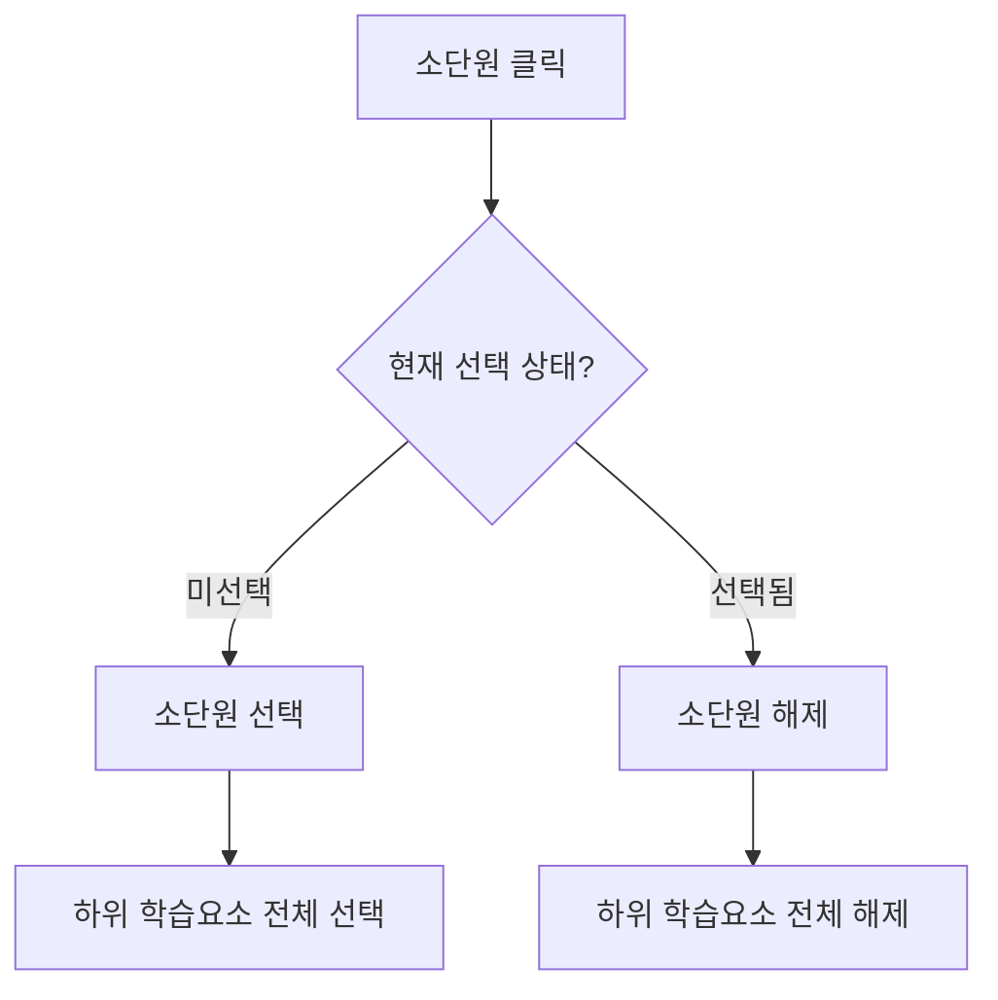
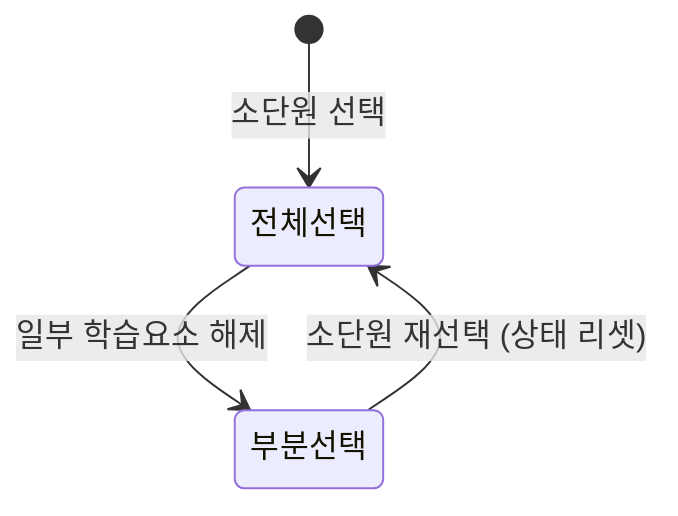
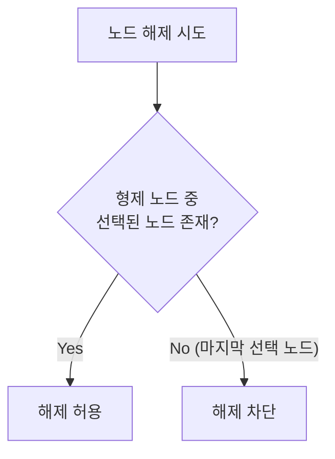
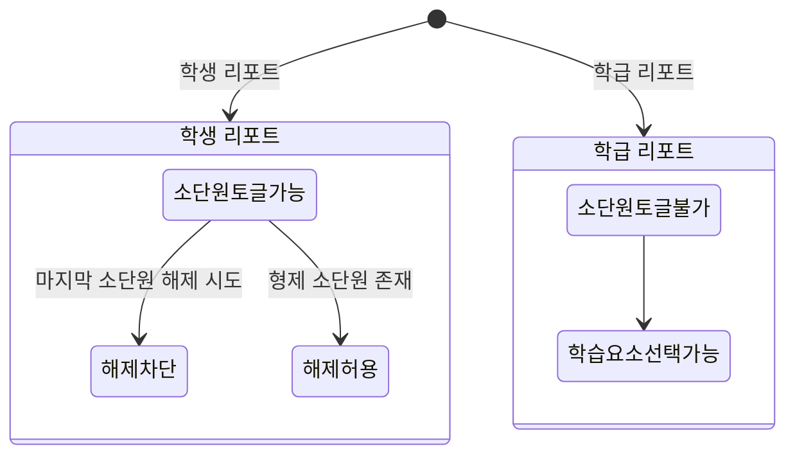

> 중첩된 트리 상태를 setState로 관리하다가 손을 들었다.  

AIDT 프로젝트에서 선생님이 학생에게 콘텐츠를 추천하는 모달을 구현해야 했다.  
핵심은 **3 Depth 학습맵 Tree View** 기반의 필터링 UI였다.  
요구사항을 처음 봤을 때는 그냥 체크박스 UI겠거니 했다.  
막상 뚜껑을 열어보니 아니었다.  

## 배경: 복잡도를 높이는 연산 조건들

학습맵 구조부터 설명하면 이렇다.  

```
대단원 (Depth 1) → 소단원 (Depth 3) → 학습요소 (Depth 5)
```

서버에서 내려오는 JSON의 Depth는 1~5인데, **의미있는 노드는 홀수 Depth(1, 3, 5)만 존재**한다.  
짝수 Depth(2, 4)는 서버 내부 구조에서 사용하는 중간 레이어고 UI에는 드러나지 않는다.  

그리고 세 레벨에서 서로 다른 선택 규칙이 적용된다.  

| 레벨 | 선택 방식 | 특이사항 |
|------|------|------|
| 대단원 | 단수 선택 | 리포트에서 선택한 값 1개가 고정됨 (모달 내 수정 불가) |
| 소단원 | 복수 선택 | 선택 시 하위 학습요소 전체 자동 선택 |
| 학습요소 | 복수 선택 | 소단원 선택 시에만 활성화 |

여기까지는 그나마 단순해 보였다. 문제는 **연산 조건들이 서로 얽혀있다**는 점이다.  

**1. 연쇄 선택 (Cascading)**  

소단원을 선택하면 하위 학습요소들이 전부 선택된다.  
해제할 때도 반대로 자식 노드들이 전부 해제된다.  
부모-자식 노드의 선택 상태가 항상 동기화되어야 한다.  



**2. 상태 리셋 (Partial → Full 선택)**  

학습요소 일부만 선택된 상태에서 소단원을 다시 선택하면 학습요소가 전체 선택으로 돌아온다.  



**3. 최소 선택 제약 (Guard)**  

최소 1개는 항상 선택 상태를 유지해야 한다.  
이걸 판단하려면 현재 노드만으로는 부족하다.  
**형제 노드의 선택 상태까지 함께 확인**해야 한다.  



**4. 리포트 타입별 분기**  

학생 리포트와 학급 리포트에서 토글 규칙이 완전히 다르다.  

- **학생 리포트**: 소단원 선택 가능, 마지막 소단원 해제 불가
- **학급 리포트**: 소단원 선택 불가, 학습요소만 선택 가능



이 조건들은 독립적으로 존재하지 않는다.  
소단원을 클릭하는 한 번의 이벤트로, 유효성 검사 → 리포트 타입 분기 → 연쇄 상태 업데이트가 동시에 일어나야 한다.  

---

## 기존 구조의 함정: useState에 중첩 객체 넣기

처음에는 서버 데이터를 그대로 `useState`에 담으려 했다.  

```typescript
const [learningMap, setLearningMap] = useState<RootAchievementNode>(data);
```

소단원 하나를 선택하면 불변성을 지키면서 아래처럼 업데이트해야 했다.  

```typescript
// 소단원 하나 선택할 때마다... (으악 이건 아니야)
setLearningMap(prev => ({
  ...prev,
  nodes: prev.nodes.map(thirdNode =>
    thirdNode.index === targetIndex
      ? {
          ...thirdNode,
          isSelected: !thirdNode.isSelected,
          nodes: thirdNode.nodes.map(fifthNode => ({
            ...fifthNode,
            isSelected: !thirdNode.isSelected,
          }))
        }
      : thirdNode
  )
}));
```

3 Depth라 그나마 이 정도다.  
Depth가 하나 더 깊었다면 더 처참했을 것이다.  

문제는 깊은 복사 코드만이 아니었다.  
학생 리포트 / 학급 리포트 분기, 마지막 소단원 해제 방지 같은 비즈니스 로직이 전부 `setLearningMap` 콜백 안에 뭉쳐야 했다.  

React state로 중첩 객체를 관리하면 두 문제가 겹친다.  
불변성을 지키는 깊은 복사 코드가 복잡해지고, 그 안에 비즈니스 로직까지 들어가면 코드가 해독 불가 수준이 된다.  

---

## 설계 아이디어: Class를 외부 스토어로

> 중첩 객체 대신 Class를 외부 스토어로 만들고, 비즈니스 로직을 그 안에 가두자.  

React의 상태로 학습맵을 들고 다니는 게 문제였다.  
`useSyncExternalStore`를 쓰면 Class 인스턴스를 React 밖에 두고, 변경 시점에만 React에 알릴 수 있다.  

역할을 이렇게 나눴다.  

- **AchievementNode**: 트리를 구성하는 노드 클래스. 선택 상태(`isSelected`)를 mutation으로 직접 변경
- **AchievementTree**: 트리 전체를 관리하는 스토어 클래스. `subscribe` / `getSnapshot` 계약 제공
- **useSyncExternalStore**: AchievementTree의 변경을 React 렌더 사이클에 연결

그 전에 `useSyncExternalStore`가 뭔지부터 짚고 넘어가자.  

---

## useSyncExternalStore 란?

`useSyncExternalStore`는 React 18에서 새롭게 선보인 Hook이다.  
이름 그대로, **외부 스토어(External Store)의 변경을 React 렌더 사이클에 동기화(Sync)** 한다.  

```typescript
const snapshot = useSyncExternalStore(subscribe, getSnapshot, getServerSnapshot?);
```

세 가지 인수를 받는다.  

1. **subscribe** — `(listener: () => void) => () => void`
   - 외부 스토어에 리스너를 등록하는 함수다.
   - 인수로 받은 `listener`를 스토어에 등록하고, 등록을 해제하는 cleanup 함수를 반환해야 한다.
2. **getSnapshot** — `() => Snapshot`
   - 인수 없이 현재 스토어의 상태를 반환하는 함수다.
   - React는 이전 호출 결과와 `Object.is`로 비교해서, 달라졌을 때만 리렌더를 트리거한다.
3. **getServerSnapshot** — `() => Snapshot` (선택)
   - SSR 환경에서 서버가 사용할 스냅샷을 반환하는 함수다.
   - SSR을 사용하는 환경에서 생략하면 에러가 발생한다.

### Shim으로 뜯어보는 내부 흐름

React 팀이 배포한 `use-sync-external-store` 패키지의 Shim 코드를 보면 내부 흐름이 명확해진다.  

```typescript
export function useSyncExternalStore(subscribe, getSnapshot) {
  const value = getSnapshot();

  const [{inst}, forceUpdate] = useState({inst: {value, getSnapshot}});

  useLayoutEffect(() => {
    inst.value = value;
    inst.getSnapshot = getSnapshot;

    if (checkIfSnapshotChanged(inst)) {
      forceUpdate({inst});
    }
  }, [subscribe, value, getSnapshot]);

  useEffect(() => {
    if (checkIfSnapshotChanged(inst)) {
      forceUpdate({inst});
    }
    const handleStoreChange = () => {
      if (checkIfSnapshotChanged(inst)) {
        forceUpdate({inst});
      }
    };
    return subscribe(handleStoreChange);
  }, [subscribe]);

  return value;
}
```

설계에서 세 가지 포인트가 눈에 띈다.  

**1. useState에 값 대신 `inst` 객체를 저장한다**  

Snapshot 값을 state에 직접 담지 않는다.  
대신 **가변 `inst` 객체**를 state 슬롯에 보관한다.  

```typescript
const [{inst}, forceUpdate] = useState({inst: {value, getSnapshot}});
```

리렌더링이 필요하면 `forceUpdate({inst})`를 호출한다.  
매번 **새 객체**를 전달하기 때문에 React 동등성 비교에서 항상 `false`가 나와 리렌더링이 보장된다.  

**2. `useLayoutEffect`로 Tearing을 막는다**  

```typescript
useLayoutEffect(() => {
  inst.value = value;
  inst.getSnapshot = getSnapshot;

  if (checkIfSnapshotChanged(inst)) {
    forceUpdate({inst}); // DOM paint 이전에 불일치 감지 → 즉시 리렌더
  }
}, [subscribe, value, getSnapshot]);
```

`useEffect`는 브라우저 Paint 이후에 비동기로 실행된다.  
Render와 Paint 사이에 Store가 바뀌면 사용자는 잠깐 Stale한 값을 보게 되는데, 이를 **Tearing**이라 한다.  
`useLayoutEffect`는 DOM 변경 직후, Paint 이전에 **동기적으로** 실행된다.  
이 타이밍에 `inst`를 업데이트하고 스냅샷 변경 여부를 재확인하기 때문에 Tearing이 방지된다.  

**3. 변경 여부를 직접 비교한다**  

```typescript
function checkIfSnapshotChanged(inst) {
  const prevValue = inst.value;
  try {
    const nextValue = inst.getSnapshot();
    return !Object.is(prevValue, nextValue);
  } catch (error) {
    return true; // getSnapshot이 throw하면 변경으로 간주
  }
}
```

스토어에서 변경 알림을 받아도 무조건 setState를 호출하지 않는다.  
**실제로 값이 달라졌을 때만** `forceUpdate`를 호출한다.  
`getSnapshot` 자체가 예외를 던지는 경우도 상태 변경으로 취급해 안전하게 리렌더링을 유발한다.  

---

## 구현 과정

### AchievementNode 클래스

```typescript
export class AchievementNode {
  public index: string;
  public title: string;
  public depth: number;
  public nodeId: string;
  public children: AchievementNode[];
  public isSelected: boolean;

  constructor(data: AchievementNodeType) {
    this.index = data.index;
    this.title = data.title;
    this.nodeId = data.nodeId;
    this.depth = data.depth;
    this.isSelected = false;
    this.children = [];

    if (data.depth === 1 || data.depth === 3) {
      data.nodes.forEach((childNode) => {
        this.children.push(new AchievementNode(childNode));
      });
    }
  }

  setSelected(updatedState: boolean) {
    this.isSelected = updatedState;
  }
}
```

생성자에서 짝수 Depth를 건너뛰어 평탄화했다.  
이후 트리 안의 모든 순회 로직이 Depth 1, 3, 5만 다루면 충분해지기 때문에 짝수 Depth를 체크하는 코드가 여기저기 흩어지는 문제를 깔끔하게 피할 수 있다.  

클래스로 노드를 설계한 핵심 이유는 **mutation을 의도적으로 허용**하기 위해서다.  
`isSelected`를 `setSelected()`로 직접 변경하면, React의 불변성 원칙을 위한 깊은 복사 없이도 노드의 선택 상태를 바꿀 수 있다.  
`useSyncExternalStore`는 **React 밖에서 mutable 객체를 관리하고, 변경이 완료된 시점에만 React에 알리는** 구조를 전제로 설계되어 있기 때문에 이처럼 직접 mutation하는 방식이 성립한다.  

### AchievementTree — subscribe / getSnapshot 구현

`useSyncExternalStore`가 요구하는 두 가지 계약을 클래스 메서드로 제공했다.  

```typescript
export class AchievementTree {
  public root: AchievementNode;
  public listeners: Set<() => void>;
  public currentSelectedNodeList: AchievementNode[];
  private reportType: AiReportType;

  constructor(
    data: RootAchievementNode,
    reportType: AiReportType,
    initialSelectedNodeIndexList: string[] = [],
  ) {
    this.root = new AchievementNode(data);
    this.listeners = new Set();
    this.currentSelectedNodeList = [];
    this.reportType = reportType;
  }

  // 화살표 함수로 선언해 this가 인스턴스에 자동 바인딩됨
  public subscribe = (listener: () => void) => {
    this.listeners.add(listener);
    return () => {
      this.listeners.delete(listener);
    };
  };

  public getSnapShot = () => {
    return this.currentSelectedNodeList;
  };

  public emitChange() {
    this.listeners.forEach((listener) => listener?.());
  }
}
```

`subscribe`와 `getSnapShot`을 일반 메서드가 아닌 **화살표 함수 프로퍼티**로 선언했다.  
일반 클래스 메서드를 `useSyncExternalStore`에 그대로 넘기면, 호출 시 `this` 컨텍스트가 소실되어 `this.listeners`를 찾지 못해 런타임 에러가 발생한다.  
화살표 함수 프로퍼티로 선언하면 `this`가 인스턴스에 고정되기 때문에 바인딩 없이 함수 참조를 그대로 전달할 수 있다.  

### 비즈니스 로직 캡슐화

리포트 타입에 따른 분기를 Tree 클래스 안에 완전히 가뒀다.  

```typescript
public toggleNodeSelected(index: string) {
  switch (this.reportType) {
    case AiReportTypeEnum.학생리포트:
      this.toggleNodeSelectedInStudentMode(index);
      break;
    case AiReportTypeEnum.학급리포트:
      this.toggleNodeSelectedInClassroomMode(index);
      break;
  }
}

private toggleNodeSelectedInStudentMode(index: string) {
  const targetNode = this.getNodeByIndex(index);
  if (!targetNode || targetNode.depth === 1) return;

  if (targetNode.depth === 3) {
    if (targetNode.isSelected) {
      const remaining = this.currentSelectedNodeList.filter(
        (node) => node !== targetNode && !targetNode.children.includes(node),
      );
      if (!remaining.length) return; // 마지막 소단원은 해제 불가
    }
    targetNode.setSelected(!targetNode.isSelected);
    targetNode.children.forEach((child) =>
      child.setSelected(!targetNode.isSelected),
    );
  }

  if (targetNode.depth === 5) {
    const parentNode = this.getParentNode(targetNode)!;
    if (!targetNode.isSelected && !parentNode.isSelected) return;
    if (targetNode.isSelected) {
      const allSiblingsUnselected = parentNode.children
        .filter((node) => node !== targetNode)
        .every((node) => !node.isSelected);
      if (allSiblingsUnselected) return; // 마지막 학습요소 해제 불가
    }
    targetNode.setSelected(!targetNode.isSelected);
  }

  this.updateSelectedNode();
  this.emitChange(); // 변경 완료 후 React에 통지
}
```

상태 변경이 끝난 뒤 반드시 `emitChange()`를 호출해야 한다.  
그래야 `useSyncExternalStore`가 `getSnapshot()`을 재호출해 리렌더를 일으킨다.  

### React에서 연결하기

```typescript
const achievementTree = useMemo(
  () => new AchievementTree(learningMap, AiReportTypeEnum.학생리포트, initialNodeIndexes),
  [learningMap],
);

const selectedNodeList: AchievementNode[] = useSyncExternalStore(
  achievementTree.subscribe,
  achievementTree.getSnapShot,
);
```

`learningMap`이 바뀔 때만 새 Tree 인스턴스를 생성하고, `useSyncExternalStore`로 렌더 사이클에 연결하는 일만 남았다.  

---

## 개선 결과

컴포넌트 코드가 단순해졌다.  

```typescript
// AS-IS: setState 콜백 안에 로직이 뒤엉킴
setLearningMap(prev => ({
  ...prev,
  nodes: prev.nodes.map(thirdNode =>
    thirdNode.index === targetIndex
      ? {
          ...thirdNode,
          isSelected: !thirdNode.isSelected,
          nodes: thirdNode.nodes.map(fifthNode => ({
            ...fifthNode,
            isSelected: !thirdNode.isSelected,
          }))
        }
      : thirdNode
  )
}));

// TO-BE: 메서드 호출 하나
achievementTree.toggleNodeSelected(targetIndex);
```

선택 노드 목록이 `AchievementNode[]`로 타입이 보장된다.  
어디서든 꺼내 쓰면 클래스 메서드를 바로 쓸 수 있다.  

학생 리포트 / 학급 리포트 토글 규칙이 Tree 클래스 안에 완전히 갇혔다.  
컴포넌트는 리포트 타입을 알 필요가 없다. Tree를 생성할 때 한 번만 넘기면 끝이다.  

---

## 주의사항

### getSnapshot 참조 동일성

`getSnapShot`이 `this.currentSelectedNodeList`를 그대로 반환한다.  
`emitChange` 없이 배열 내부만 변경되면 React가 변경을 감지하지 못할 수 있다.  
`updateSelectedNode`에서 새 배열 참조를 만들어주면 더 안전하다.  

```typescript
public updateSelectedNode() {
  const selectedNodeList: AchievementNode[] = [];
  // 순회 로직...
  this.currentSelectedNodeList = [...selectedNodeList]; // spread로 새 배열 참조 보장
}
```

### unsubscribe 로직 버그

실제로 합쳐진 코드에 버그가 하나 있었다.  
`subscribe`가 반환하는 정리 함수가 잘못 작성됐다.  

```typescript
// ❌ 현재 코드 — !this.listeners.has(element)는 항상 false → 빈 Set 반환
return () => {
  this.listeners = new Set(
    Array.from(this.listeners).filter(
      (element) => !this.listeners.has(element),
    ),
  );
};

// ✅ 올바른 구현 — 클로저로 캡처한 listener와 비교해 해당 리스너만 제거
return () => {
  this.listeners = new Set(
    Array.from(this.listeners).filter(
      (element) => element !== listener,
    ),
  );
};
```

언마운트 시 의도한 리스너만 제거되어야 하는데, 잘못된 코드는 Set 전체를 비워버린다.  
현재 구현에서는 인스턴스가 `useMemo` 범위 안에서만 관리되어 실제로 터지지 않았다.  
하지만 리스너가 복수로 붙는 상황이 생기면 바로 문제가 된다.  

`Set.delete`를 직접 써서 해당 리스너만 정확히 제거하는 게 더 명확하다.  

```typescript
public subscribe = (listener: () => void) => {
  this.listeners.add(listener);
  return () => {
    this.listeners.delete(listener);
  };
};
```

---

## 인사이트

`useSyncExternalStore`가 진가를 발휘하는 상황은 정해져 있다.  

**복잡한 비즈니스 로직이 상태 업데이트 함수 안에 뭉치기 시작할 때.**  

중첩 트리, 연쇄 선택, 조건부 분기처럼 상태 업데이트에 논리가 많이 얽힌 경우, Class를 외부 스토어로 만들면 세 가지를 동시에 얻는다.  

- mutation을 허용해 깊은 복사 코드를 제거한다
- 비즈니스 로직을 클래스 안에 캡슐화한다
- 컴포넌트는 메서드 호출 한 줄로 상태를 바꾼다

반대로 단순한 토글이나 카운터 같은 상태는 `useState`로 충분하다.  
`useSyncExternalStore`를 쓴다고 항상 좋은 설계가 되는 게 아니다.  
복잡도가 임계점을 넘는 순간에 꺼내는 도구다.  
