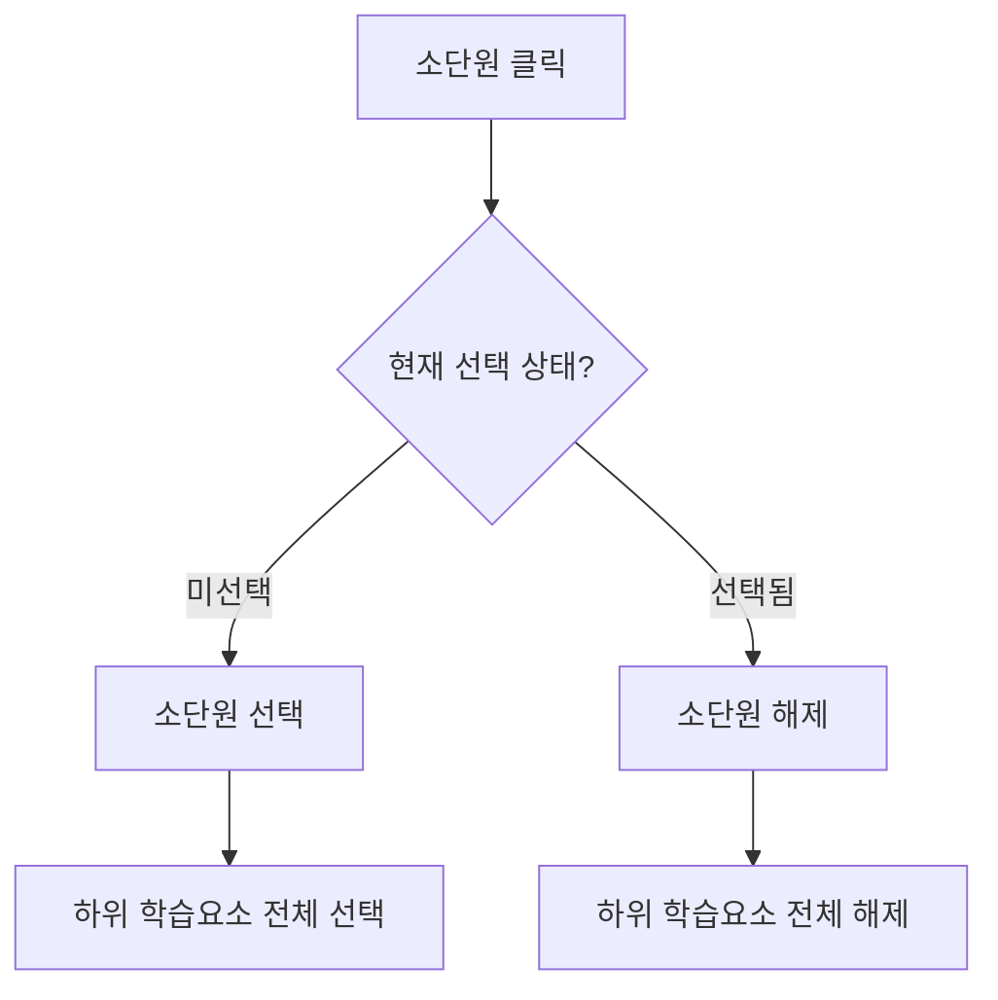
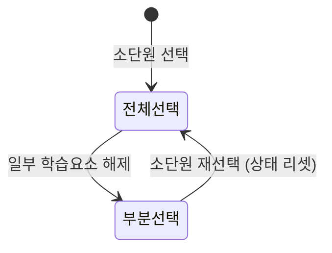
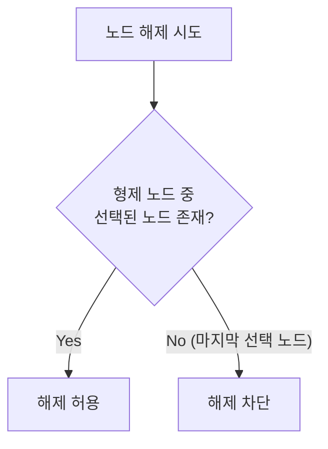
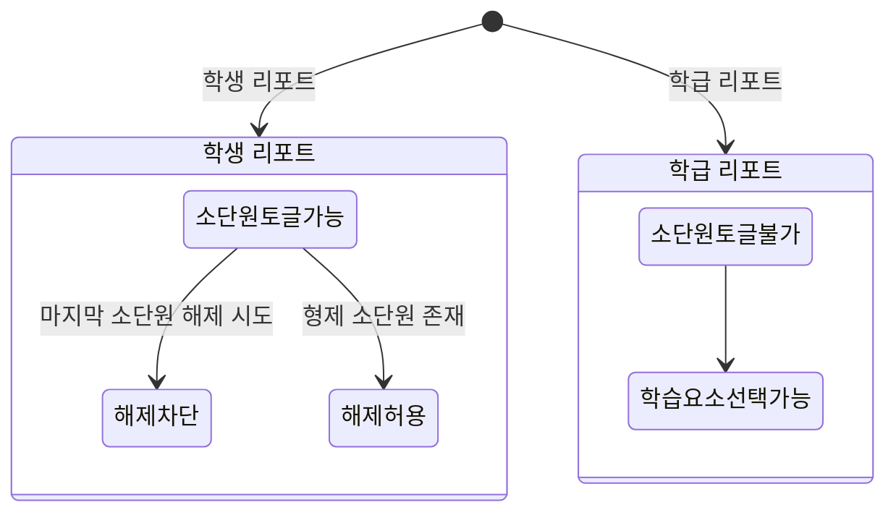

> 중첩된 트리 상태를 setState로 관리하다가 손을 들었다.

선생님이 학생에게 콘텐츠를 추천하는 모달을 구현하게 됐는데, 핵심은 **3 Depth 학습맵 Tree View** 기반의 필터링 UI였다.
처음 요구사항을 봤을 때는 그냥 체크박스 UI겠거니 싶었는데, 막상 뚜껑을 열어보니 그게 아니어서 매우 당황했던 기억이 난다.
---

## 배경: 복잡도를 높이는 연산 조건들

먼저 대략적인 학습맵 구조부터 설명하면 이렇다.

```
대단원 (Depth 1) → 소단원 (Depth 3) → 학습요소 (Depth 5)
```

서버에서 내려오는 JSON의 Depth는 1~5인데, **의미있는 노드는 홀수 Depth(1, 3, 5)만 존재**한다.
짝수 Depth(2, 4)는 서버 내부 구조에서 사용하는 중간 레이어고 UI에는 드러나지 않는다.

그리고 세 레벨에서 서로 다른 선택 규칙이 적용된다.

| 레벨 | 선택 방식 | 특이사항 |
|------|------|------|
| 대단원 | 단수 선택 | 리포트에서 선택한 값 1개가 고정됨 (모달 내 수정 불가) |
| 소단원 | 복수 선택 | 선택 시 하위 학습요소 전체 자동 선택 |
| 학습요소 | 복수 선택 | 소단원 선택 시에만 활성화 |

여기까지는 그나마 단순해 보였다. 문제는 **연산 조건들이 서로 얽혀있다**는 점이다.

**1. 연쇄 선택 (Cascading)**

소단원을 선택하면 하위 학습요소들이 전부 선택되고 해제할 때도 반대로 자식 노드들이 전부 해제되기 때문에, 부모-자식 노드의 선택 상태가 항상 동기화되어야 한다.



**2. 상태 리셋 (Partial → Full 선택)**

학습요소 일부만 선택된 상태에서 소단원을 다시 선택하면 학습요소가 전체 선택으로 돌아온다.



**3. 최소 선택 제약 (Guard)**

최소 1개는 항상 선택 상태를 유지해야 하는데, 이걸 판단하려면 현재 노드만으로는 부족하고 **형제 노드의 선택 상태까지 함께 확인**해야 한다.



**4. 리포트 타입별 분기**

학생 리포트와 학급 리포트에서 토글 규칙이 완전히 다르다.

- **학생 리포트**: 소단원 선택 가능, 마지막 소단원 해제 불가
- **학급 리포트**: 소단원 선택 불가, 학습요소만 선택 가능



이 조건들은 독립적으로 존재하지 않아서, 소단원을 클릭하는 한 번의 이벤트로 유효성 검사 → 리포트 타입 분기 → 연쇄 상태 업데이트가 동시에 일어나야 한다.

---

## 기존 구조의 함정: useState에 중첩 객체 넣기

처음에는 서버 데이터를 그대로 `useState`에 담으려 했다.

```typescript
const [learningMap, setLearningMap] = useState<RootAchievementNode>(data);
```

소단원 하나를 선택하면 불변성을 지키면서 아래처럼 업데이트해야 했다.

```typescript
// 소단원 하나 선택할 때마다... (으악 이건 아니야)
setLearningMap(prev => ({
  ...prev,
  nodes: prev.nodes.map(thirdNode =>
    thirdNode.index === targetIndex
      ? {
          ...thirdNode,
          isSelected: !thirdNode.isSelected,
          nodes: thirdNode.nodes.map(fifthNode => ({
            ...fifthNode,
            isSelected: !thirdNode.isSelected,
          }))
        }
      : thirdNode
  )
}));
```

3 Depth라 그나마 이 정도인데, Depth가 하나 더 깊었다면 더 처참했을 것이다.

문제는 깊은 복사 코드만이 아니었다.
학생 리포트 / 학급 리포트 분기, 마지막 소단원 해제 방지 같은 비즈니스 로직이 전부 `setLearningMap` 콜백 안에 뭉쳐야 했다.

React state로 중첩 객체를 관리하면 두 문제가 겹치는데, 불변성을 지키는 깊은 복사 코드가 복잡해지고 그 안에 비즈니스 로직까지 들어가면 코드가 해독 불가 수준이 된다.

---

## 설계 아이디어: Class를 외부 스토어로

> 중첩 객체 대신 Class를 외부 스토어로 만들고, 비즈니스 로직을 그 안에 가두자.

React의 상태로 학습맵을 들고 다니는 게 문제였다.
`useSyncExternalStore`를 쓰면 Class 인스턴스를 React 밖에 두고, 변경 시점에만 React에 알릴 수 있다.
이 훅의 동작 원리는 [useSyncExternalStore 내부를 들여다보다](/posts/react-use-sync-external-store-internals)에서 먼저 정리해뒀다.

역할을 이렇게 나눴다.

- **AchievementNode**: 트리를 구성하는 노드 클래스. 선택 상태(`isSelected`)를 mutation으로 직접 변경
- **AchievementTree**: 트리 전체를 관리하는 스토어 클래스. `subscribe` / `getSnapshot` 계약 제공
- **useSyncExternalStore**: AchievementTree의 변경을 React 렌더 사이클에 연결

---

## 구현: AchievementNode와 AchievementTree

### AchievementNode — 왜 직접 mutation을 허용하는가

```typescript
export class AchievementNode {
  public index: string;
  public title: string;
  public depth: number;
  public nodeId: string;
  public children: AchievementNode[];
  public isSelected: boolean;

  constructor(data: AchievementNodeType) {
    this.index = data.index;
    this.title = data.title;
    this.nodeId = data.nodeId;
    this.depth = data.depth;
    this.isSelected = false;
    this.children = [];

    if (data.depth === 1 || data.depth === 3) {
      data.nodes.forEach((childNode) => {
        this.children.push(new AchievementNode(childNode));
      });
    }
  }

  setSelected(updatedState: boolean) {
    this.isSelected = updatedState;
  }
}
```

코드를 보면 눈에 띄는 설계 결정이 세 가지 있다.

1. **`isSelected`는 서버 데이터에 없다.** 선택 상태는 UI에서만 필요하기 때문에 생성자에서 `false`로 초기화한다. 서버 응답 구조에 UI 상태를 섞지 않겠다는 결정이다.

2. **`depth === 1 || depth === 3`에서만 자식을 생성한다.** 서버 JSON에는 Depth 2, 4가 실제로 존재하지만 여기서 건너뛴다. 생성자에서 한 번만 처리하면 이후 모든 순회 코드가 "홀수 Depth만 있다"는 전제로 단순하게 작성된다. 만약 서버 데이터를 그대로 담았다면 트리 순회마다 짝수 Depth 체크가 필요했을 것이다.

3. **`setSelected()`로 직접 mutation한다.** React의 일반적인 원칙에 반하지만, 이 클래스는 React state가 아니다. `useSyncExternalStore`는 "React 외부에서 mutable 객체를 관리하고, 변경이 완료된 시점에만 알리는" 구조를 전제로 설계되어 있다. 그 구조 위에서 직접 mutation이 성립한다.

### AchievementTree — 왜 listeners를 Set으로, 메서드를 화살표 함수로 선언했는가

```typescript
export class AchievementTree {
  public root: AchievementNode;
  private listeners: Set<() => void>;
  private currentSelectedNodeList: AchievementNode[];
  private reportType: AiReportType;

  constructor(
    data: RootAchievementNode,
    reportType: AiReportType,
    initialSelectedNodeIndexList: string[] = [],
  ) {
    this.root = new AchievementNode(data);
    this.listeners = new Set();
    this.currentSelectedNodeList = [];
    this.reportType = reportType;
  }

  public subscribe = (listener: () => void) => {
    this.listeners.add(listener);
    return () => {
      this.listeners.delete(listener);
    };
  };

  public getSnapShot = () => {
    return this.currentSelectedNodeList;
  };

  private emitChange() {
    this.listeners.forEach((listener) => listener?.());
  }
}
```

각 설계 결정에는 이유가 있다.

1. **`listeners`를 `Set`으로 관리한다.** 
  - `Array`를 쓰면 동일한 리스너를 중복 등록해도 막을 수가 없다. `Set`은 중복을 자동으로 걸러내고, `Set.prototype.delete()`로 클로저에 캡처된 특정 리스너만 정확히 제거할 수 있다.

2. **`subscribe`와 `getSnapShot`을 화살표 함수 프로퍼티로 선언한다.**
  - 두 메서드 모두 `useSyncExternalStore`에 함수 참조로 넘겨진다. 
  - 일반 클래스 메서드로 선언하면 호출 시점에 `this` 컨텍스트가 소실되어 `this.listeners`를 찾지 못해 런타임 에러가 발생한다. 
  - 화살표 함수 프로퍼티는 선언 시점에 `this`가 고정되기 때문에 `.bind()` 없이 그대로 전달할 수 있다.

3. **`emitChange`를 `private`으로 둔다.** 
  - 외부에서 이 메서드를 직접 호출하면 실제 상태 변경 없이 리렌더가 발생한다. 
  - 리스너에게 통지하는 것은 항상 상태 변경의 마지막 단계여야 하므로, 클래스 내부에서만 사용하도록 접근을 제한했다.

### 왜 진입점을 하나로 고정했는가

```typescript
public toggleNodeSelected(index: string) {
  switch (this.reportType) {
    case AiReportTypeEnum.학생리포트:
      this.toggleNodeSelectedInStudentMode(index);
      break;
    case AiReportTypeEnum.학급리포트:
      this.toggleNodeSelectedInClassroomMode(index);
      break;
  }
}

private toggleNodeSelectedInStudentMode(index: string) {
  const targetNode = this.getNodeByIndex(index);
  if (!targetNode || targetNode.depth === 1) return;

  if (targetNode.depth === 3) {
    // Guard: 마지막 소단원은 해제 불가
    if (targetNode.isSelected) {
      const remaining = this.currentSelectedNodeList.filter(
        (node) => node !== targetNode && !targetNode.children.includes(node),
      );
      if (!remaining.length) return;
    }
    // Cascading: 소단원 선택 상태를 자식 전체에 동기화
    const newState = !targetNode.isSelected;
    targetNode.setSelected(newState);
    targetNode.children.forEach((child) => child.setSelected(newState));
  }

  if (targetNode.depth === 5) {
    const parentNode = this.getParentNode(targetNode)!;
    // 소단원이 선택되지 않은 상태에서 하위 학습요소 선택 불가
    if (!targetNode.isSelected && !parentNode.isSelected) return;
    // Guard: 마지막 학습요소 해제 불가
    if (targetNode.isSelected) {
      const allSiblingsUnselected = parentNode.children
        .filter((node) => node !== targetNode)
        .every((node) => !node.isSelected);
      if (allSiblingsUnselected) return;
    }
    targetNode.setSelected(!targetNode.isSelected);
  }

  this.updateSelectedNode();
  this.emitChange(); // 변경 완료 후 React에 통지
}
```

이 진입점 설계에 담긴 의도가 네 가지 있다.

1. **컴포넌트는 `toggleNodeSelected(index)` 하나만 호출한다.** 어떤 모드인지, 어떤 Depth의 노드인지 알 필요가 없다. 호출하면 끝이다.

2. **`reportType`에 따라 내부에서 분기한다.** 학생 리포트와 학급 리포트 각각의 로직이 별도 private 메서드로 격리된다. 새로운 리포트 타입이 추가되어도 `switch` 케이스를 하나 추가하면 된다.

3. **Cascading에서 `newState`를 먼저 캡처한다.** `setSelected()`를 호출하면 `targetNode.isSelected`가 즉시 바뀐다. 그 이후에 `!targetNode.isSelected`를 참조하면 원래 의도한 것과 반대 값이 된다. 토글 전 상태를 `newState`에 미리 캡처해두고 자식에게도 같은 값을 전달하는 게 버그를 막는다.

4. **`emitChange()`는 모든 노드 변경이 끝난 뒤 한 번만 호출한다.** 만약 각 노드 변경마다 호출하면 중간 상태로 리렌더링이 발생한다. 여러 노드를 한 번에 변경하고 마지막에 신호를 보내야 온전한 변경 후 상태를 보여준다.

### React와 연결하기: useMemo로 인스턴스를 보호한다

```typescript
const achievementTree = useMemo(
  () => new AchievementTree(learningMap, AiReportTypeEnum.학생리포트, initialNodeIndexes),
  [learningMap],
);

const selectedNodeList: AchievementNode[] = useSyncExternalStore(
  achievementTree.subscribe,
  achievementTree.getSnapShot,
);
```

여기서 짚어둘 포인트가 두 가지 있다.

1. **`useMemo`로 인스턴스 생성을 제어한다.** `learningMap`이 바뀌지 않는 한 같은 트리 인스턴스를 재사용한다. 트리 생성에는 데이터를 파싱하고 노드를 재귀적으로 생성하는 비용이 있다. 컴포넌트 리렌더마다 새로 만드는 건 낭비다.

2. **컴포넌트가 구독하는 건 `selectedNodeList` 하나다.** `emitChange()`가 호출되면 `getSnapshot()`을 재호출해 새 배열 참조를 받고, 이전과 다르면 리렌더된다. Cascading이든 Guard든 리포트 타입 분기든 간에 컴포넌트는 어떤 규칙이 적용됐는지 알지 못하고, 알 필요도 없다.

---

## 개발 중 만난 버그: unsubscribe 정리 함수의 오류

실제로 합쳐진 코드에 버그가 하나 있었는데, `subscribe`가 반환하는 정리 함수가 잘못 작성됐기 때문이다.

```typescript
// ❌ 잘못된 구현 — !this.listeners.has(element)는 항상 false → 빈 Set 반환
return () => {
  this.listeners = new Set(
    Array.from(this.listeners).filter(
      (element) => !this.listeners.has(element),
    ),
  );
};

// ✅ 올바른 구현 — Set.delete로 클로저에 캡처된 listener만 정확히 제거
return () => {
  this.listeners.delete(listener);
};
```

언마운트 시 의도한 리스너만 제거되어야 하는데, 잘못된 코드는 Set 전체를 비워버린다.
현재 구현에서는 인스턴스가 `useMemo` 범위 안에서만 관리되어 실제로는 터지지 않았지만, 리스너가 복수로 붙는 상황이 생기면 바로 문제가 된다.

---

## 달성한 것: setState 콜백에서 메서드 호출 하나로

컴포넌트 코드가 단순해졌다.

```typescript
// AS-IS: setState 콜백 안에 로직이 뒤엉킴
setLearningMap(prev => ({
  ...prev,
  nodes: prev.nodes.map(thirdNode =>
    thirdNode.index === targetIndex
      ? {
          ...thirdNode,
          isSelected: !thirdNode.isSelected,
          nodes: thirdNode.nodes.map(fifthNode => ({
            ...fifthNode,
            isSelected: !thirdNode.isSelected,
          }))
        }
      : thirdNode
  )
}));

// TO-BE: 메서드 호출 하나
achievementTree.toggleNodeSelected(targetIndex);
```

최상위부터 말단 노드까지 이어지던 스프레드 연산자와 `map` 체인이 사라졌고, Cascading, Guard 같은 도메인 규칙이 `setState` 콜백 안에 뒤섞이지 않는다.

선택 노드 목록이 `AchievementNode[]`로 타입이 보장되기 때문에 어디서든 꺼내 쓰면 클래스 메서드를 바로 쓸 수 있다.

학생 리포트 / 학급 리포트 토글 규칙이 Tree 클래스 안에 완전히 갇혔기 때문에 컴포넌트는 리포트 타입을 알 필요가 없고, Tree를 생성할 때 한 번만 넘기면 끝이다.

---

## 주의사항: getSnapshot의 참조 동일성

`getSnapShot`이 `this.currentSelectedNodeList`를 그대로 반환하는 구조이기 때문에, `emitChange` 없이 배열 내부만 변경되면 React가 변경을 감지하지 못할 수 있다. `updateSelectedNode`에서 새 배열 참조를 만들어주면 더 안전하다.

```typescript
public updateSelectedNode() {
  const selectedNodeList: AchievementNode[] = [];
  // 순회 로직...
  this.currentSelectedNodeList = [...selectedNodeList]; // spread로 새 배열 참조 보장
}
```

---

## 마치며

처음엔 `useState`로도 충분히 다룰 수 있을 거라 생각했다.
노드 하나를 바꾸기 위해 최상위부터 전부 복사해야 하는 코드를 마주하고 나서야 접근이 틀렸다는 걸 깨달았다.

`useSyncExternalStore`가 진가를 발휘하는 상황은 결국 하나로 수렴하는 것 같은데, **복잡한 비즈니스 로직이 상태 업데이트 함수 안에 뭉치기 시작할 때**가 바로 그 지점이다.

그 이전에는 `useState`로 충분하고, 그 이후에는 Class를 외부 스토어로 꺼내는 게 맞다.
"어떻게 불변성을 지키며 업데이트할까"가 아니라 "이 로직 자체를 React 밖으로 꺼낼 수 있을까"를 먼저 고민하게 됐다.
