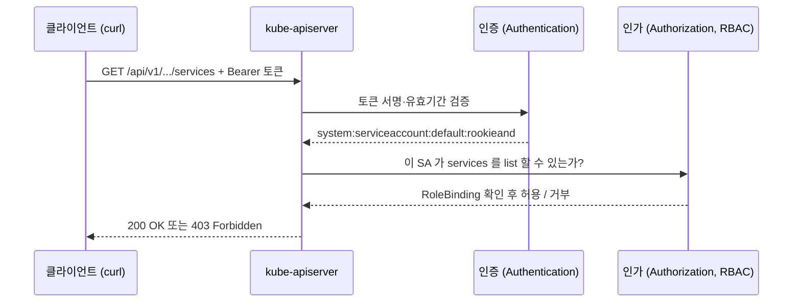

## 10. 보안을 위한 인증과 인가 : ServiceAccount 와 RBAC

쿠버네티스는 컨테이너 오케스트레이션 기능만 제공하는 게 아니라 보안 측면에서도 여러 장치를 갖추고 있다.
그중 하나가 RBAC(Role-Based Access Control) 기반의 `ServiceAccount` 다.

`ServiceAccount` 는 클러스터를 사용하는 한 명의 사용자나 하나의 애플리케이션에 대응되는 오브젝트다.
여기에 RBAC 로 "무엇을 할 수 있는지" 권한을 부여하는 방식으로 접근을 제어한다.

리눅스에서 root 유저와 일반 유저를 나눠 권한을 통제하는 것과 비슷하다고 생각하면 이해가 빠르다.
우리가 평소에 쓰는 `kubectl` 명령어는 사실 클러스터 최상위 권한을 그대로 들고 있다.
혼자 로컬에서 실습할 때는 문제가 없지만, 여러 사용자가 클러스터를 공유하거나 kubernetes API 를 호출하는 애플리케이션을 배포하는 순간 이야기가 달라진다.
필요한 만큼만 권한을 떼어주는 최소 권한 원칙이 필요해지는 것이다.

---

## 10.1 쿠버네티스의 권한 인증 과정

권한 이야기를 하기 전에, `kubectl` 로 명령을 내렸을 때 클러스터 안에서 무슨 일이 벌어지는지부터 짚고 가자.
kubernetes 의 API 서버는 `kube-apiserver` 라는 컴포넌트이며, `kube-system` 네임스페이스 안에서 동작한다.
우리가 실행하는 거의 모든 `kubectl` 명령은 결국 이 API 서버로 향하는 HTTP 요청으로 바뀐다.

요청이 실제 기능으로 이어지기까지는 세 단계를 거친다.

| 단계 | 담당 | 핵심 동작 |
|---|---|---|
| 1. 인증 (Authentication) | kube-apiserver | 요청을 보낸 주체가 누구인지 확인 (인증서, ServiceAccount 토큰, OIDC 등) |
| 2. 인가 (Authorization) | RBAC 등 | 그 주체가 이 동작을 할 권한이 있는지 확인 |
| 3. 어드미션 컨트롤 (Admission Control) | Admission Controller | 요청 내용을 검증·변형한 뒤 최종 반영 |

즉 "너 누구야"(인증) → "그거 해도 돼?"(인가) → "내용은 문제없어?"(어드미션) 순으로 걸러지는 셈이다.

그렇다면 `kubectl` 은 자신이 누구인지 어떻게 증명할까.
kubernetes 를 설치할 때 설치 도구가 `kubectl` 에게 관리자 권한을 자동으로 쥐여준다.
그 정보는 `~/.kube/config` 파일에 담겨 있고, `kubectl` 은 명령을 실행할 때마다 이 파일을 읽어 클러스터에 인증한다.

```yaml
## ~/.kube/config (일부)
users:
  - name: kubernetes-admin
    user:
      client-certificate-data: LS0tLS1CRUdJTi...   # base64 로 인코딩된 클라이언트 인증서
      client-key-data: LS0tLS1CRUdJTi...            # base64 로 인코딩된 개인 키
```

`users` 항목의 `client-certificate-data` 와 `client-key-data` 가 인증에 쓰이는 데이터다.
둘 다 base64 로 인코딩된 인증서인데, 이 인증서의 주인이 바로 `cluster-admin` 즉 클러스터 최고 권한을 가진 관리자다.
그래서 우리가 아무 옵션 없이 `kubectl delete` 를 날려도 다 지워지는 것이다.

이렇게 인증서 키 쌍으로도 API 인증이 가능하지만, 사용자마다 인증서를 발급하고 배포하는 일은 꽤 번거롭다.
그래서 실제로는 뒤에서 다룰 `ServiceAccount` 토큰 방식을 더 자주 쓴다.

---


## 10.2 서비스 어카운트와 Role, ClusterRole

`ServiceAccount` 는 권한을 체계적으로 관리하기 위한 kubernetes 오브젝트다.
앞서 말했듯 한 명의 사용자나 하나의 애플리케이션에 대응된다고 보면 된다.
네임스페이스에 속하는 오브젝트이며, `sa` 또는 `serviceaccount` 라는 이름으로 다룬다.

따로 만들지 않아도 네임스페이스마다 `default` 라는 이름의 ServiceAccount 가 기본으로 하나 존재한다.
네임스페이스에 파드를 띄우면 이 `default` SA 가 자동으로 붙는다.

```shell
## ServiceAccount 생성
kubectl create serviceaccount rookieand

## 생성된 목록 확인 (sa 는 serviceaccount 의 축약형)
kubectl get sa
```

ServiceAccount 를 만들었다면 `--as` 옵션으로 특정 SA 인 척 명령을 실행해볼 수 있다.
방금 만든 `rookieand` SA 로 서비스 목록을 조회해보자.

```shell
kubectl get services --as=system:serviceaccount:default:rookieand
```

`--as` 뒤에 붙은 문자열이 낯설 텐데, 콜론으로 끊어 읽으면 의미가 보인다.

| 조각 | 의미 |
|---|---|
| `system:serviceaccount` | 이 주체가 ServiceAccount 임을 나타내는 접두사 |
| `default` | SA 가 속한 네임스페이스 |
| `rookieand` | SA 의 이름 |

즉 "default 네임스페이스의 rookieand 라는 ServiceAccount 로 실행해줘" 라는 뜻이다.

그런데 이 명령을 실행하면 서비스 목록 대신 `Forbidden` 에러가 돌아온다.

```
Error from server (Forbidden): services is forbidden:
User "system:serviceaccount:default:rookieand" cannot list resource "services"
in API group "" in the namespace "default"
```

방금 만든 `rookieand` SA 는 default 네임스페이스에서 서비스 목록을 조회할 권한을 아직 부여받지 못했다.
`default` SA 나 관리자 인증서와 달리, 새로 만든 SA 는 아무 권한도 없는 백지 상태에서 출발하기 때문이다.
결국 SA 만 만든다고 끝이 아니라, 여기에 적절한 권한을 붙여줘야 비로소 쓸모가 생긴다.

kubernetes 에서 권한을 정의하는 오브젝트는 두 가지다. 바로 `Role` 과 `ClusterRole` 이다.
둘 다 "무엇에 대해 어떤 동작을 허용할지"를 담는 그릇이고, 차이는 그 권한이 미치는 범위에 있다.

`Role` 은 네임스페이스에 속한다.
그래서 "default 네임스페이스에서 Deployment 를 생성할 수 있다", "production 네임스페이스에서 Service 목록을 조회할 수 있다" 처럼 특정 네임스페이스 안의 리소스에 대한 권한을 정의할 때 쓴다.

`ClusterRole` 은 클러스터 전체에 걸친 권한을 정의한다.
7 장에서 살펴봤듯 `Node` 나 `PersistentVolume` 같은 오브젝트는 네임스페이스에 속하지 않는데(클러스터 스코프), 이런 리소스에 대한 권한은 `Role` 로는 표현할 수 없고 `ClusterRole` 이어야 한다.
여러 네임스페이스에서 공통으로 쓰이는 권한을 한 번 정의해두고 재사용하는 용도로도 쓰인다.

```shell
kubectl get role          # 네임스페이스에 속한 Role 목록
kubectl get clusterrole   # 클러스터 스코프의 ClusterRole 목록
```

`kubectl get clusterrole` 를 처음 실행하면 목록이 꽤 길어서 조금 당황할 수 있다.
kubernetes 컴포넌트들이 내부적으로 쓰는 권한까지 전부 ClusterRole 로 관리되기 때문이다.
`cluster-admin`, `nginx-ingress-clusterrole` 같은 이름이 그 대표적인 예다.

이제 서비스 목록을 조회할 수 있는 Role 을 직접 만들어보자.

```yaml
## service-reader-role.yml
apiVersion: rbac.authorization.k8s.io/v1
kind: Role
metadata:
  namespace: default
  name: service-reader
rules:
  - apiGroups: [""]              # 코어 API 그룹 (빈 문자열)
    resources: ["services"]
    verbs: ["get", "list"]
```

`metadata.namespace` 는 이 Role 이 생성될 네임스페이스를, `metadata.name` 은 Role 의 이름을 지정한다.
핵심은 `rules` 항목이다. 세 가지 필드가 조합되어 하나의 권한을 이룬다.

1. `apiGroups` — 권한을 부여할 오브젝트가 속한 API 그룹. 빈 문자열 `""` 은 Pod·Service 같은 코어 리소스가 속한 코어 API 그룹을 의미한다. Deployment 라면 `apps` 가 된다.
2. `resources` — 권한을 부여할 오브젝트의 종류. 여기서는 `services` 다.
3. `verbs` — 그 오브젝트에 대해 허용할 동작. `get`, `list`, `create`, `update`, `delete`, `watch` 등이 있다.

종합하면 이 Role 은 "코어 API 그룹의 service 리소스에 대해 `get` 과 `list` 를 할 수 있다"는 권한이 된다.

```shell
kubectl apply -f service-reader-role.yml
```

Role 을 만들었다고 해서 `rookieand` SA 가 곧바로 이 권한을 얻는 건 아니다.
Role 은 어디까지나 "이런 권한이 있다"는 정의일 뿐, 누구에게 줄지는 아직 정해지지 않았다.
이 둘을 이어주는 오브젝트가 `RoleBinding` 이다.

```yaml
## service-reader-binding.yml
apiVersion: rbac.authorization.k8s.io/v1
kind: RoleBinding
metadata:
  namespace: default
  name: service-reader-binding
subjects:                         # 권한을 받을 대상
  - kind: ServiceAccount
    name: rookieand
    namespace: default
roleRef:                          # 연결할 Role
  kind: Role
  name: service-reader
  apiGroup: rbac.authorization.k8s.io
```

`subjects` 에는 권한을 받을 대상을, `roleRef` 에는 연결할 Role 을 지정한다.
위 예시는 `rookieand` ServiceAccount 를 `service-reader` Role 에 연결한다.
이제 아까 `Forbidden` 이 나던 명령을 다시 실행하면 서비스 목록이 정상적으로 조회된다.

```shell
kubectl apply -f service-reader-binding.yml
kubectl get services --as=system:serviceaccount:default:rookieand   # 이제 성공한다
```

여기서 한 가지 기억해둘 점이 있다.
RoleBinding, Role, ServiceAccount 는 1:1 관계가 아니다.
하나의 Role 은 여러 RoleBinding 에서 참조될 수 있고, 하나의 ServiceAccount 도 여러 RoleBinding 을 통해 각기 다른 권한을 받을 수 있다.
Role 은 권한을 정의해둔 템플릿이고, RoleBinding 은 그 템플릿과 대상을 이어주는 중간 다리라고 이해하면 이 관계가 자연스럽게 그려진다.

### 10.2.1 Role vs ClusterRole

앞서 `Node` 나 `PersistentVolume` 처럼 네임스페이스에 속하지 않는 오브젝트는 `ClusterRole` 로 다뤄야 한다고 했다.
이번엔 노드 목록을 조회할 수 있는 ClusterRole 을 만들어보자.

```yaml
## nodes-reader-clusterrole.yml
apiVersion: rbac.authorization.k8s.io/v1
kind: ClusterRole
metadata:
  name: nodes-reader        # 네임스페이스 항목이 없다는 점에 주목
rules:
  - apiGroups: [""]
    resources: ["nodes"]
    verbs: ["get", "list"]
```

`kind` 가 `ClusterRole` 이고 `metadata` 에 `namespace` 가 없다는 점을 빼면 Role 과 사실상 똑같이 생겼다.
`resources` 에 `nodes`, `verbs` 에 `get` 과 `list` 를 넣어 노드 목록을 조회할 수 있는 ClusterRole 을 정의했다.

연결하는 방법도 대칭적이다.
Role 에 RoleBinding 이 있었듯, ClusterRole 에는 `ClusterRoleBinding` 이 있다.

```yaml
## nodes-reader-binding.yml
apiVersion: rbac.authorization.k8s.io/v1
kind: ClusterRoleBinding
metadata:
  name: nodes-reader-binding
subjects:
  - kind: ServiceAccount
    name: rookieand
    namespace: default
roleRef:
  kind: ClusterRole
  name: nodes-reader
  apiGroup: rbac.authorization.k8s.io
```

```shell
kubectl apply -f nodes-reader-binding.yml
kubectl get nodes --as=system:serviceaccount:default:rookieand   # 노드 목록이 조회된다
```

한 가지 짚어둘 만한 조합이 있다.
`ClusterRole` 을 `ClusterRoleBinding` 이 아니라 `RoleBinding` 으로 연결하면, 그 ClusterRole 에 정의된 권한이 RoleBinding 이 속한 네임스페이스 안으로만 한정되어 적용된다.
"서비스 목록 조회" 같은 공통 권한을 ClusterRole 로 한 번만 정의해두고, 네임스페이스마다 RoleBinding 으로 필요한 범위만 떼어주는 식으로 재사용할 수 있는 것이다.

### 10.2.2 여러 개의 ClusterRole 을 조합해서 사용하기

자주 쓰이는 ClusterRole 이 여러 개 있다면, 이들을 하나의 ClusterRole 로 묶어서 재사용할 수 있다.
이 기능을 ClusterRole Aggregation 이라고 한다.

정의하는 방식 자체는 일반 ClusterRole 과 같지만, `rules` 를 직접 채우는 대신 `aggregationRule.clusterRoleSelectors` 라는 항목을 사용한다.

```yaml
## 라벨로 하위 ClusterRole 을 끌어모으는 상위 ClusterRole
apiVersion: rbac.authorization.k8s.io/v1
kind: ClusterRole
metadata:
  name: monitoring
aggregationRule:
  clusterRoleSelectors:
    - matchLabels:
        rbac.example.com/aggregate-to-monitoring: "true"
rules: []   # 비워둔다 — 컨트롤러가 채워준다
```

`rules` 를 비워둔 게 실수가 아니다.
이 상위 ClusterRole 은 `matchLabels` 조건에 맞는 라벨을 가진 다른 ClusterRole 들을 자동으로 찾아 그 권한을 합쳐온다.

```yaml
## 위 셀렉터에 걸리는 하위 ClusterRole
apiVersion: rbac.authorization.k8s.io/v1
kind: ClusterRole
metadata:
  name: monitoring-endpoints
  labels:
    rbac.example.com/aggregate-to-monitoring: "true"   # 이 라벨이 열쇠다
rules:
  - apiGroups: [""]
    resources: ["services", "endpoints", "pods"]
    verbs: ["get", "list", "watch"]
```

`monitoring-endpoints` 를 만들면, 컨트롤 플레인이 라벨을 보고 `monitoring` ClusterRole 의 `rules` 를 자동으로 채워준다.
나중에 같은 라벨을 가진 ClusterRole 을 하나 더 추가하면 `monitoring` 의 권한도 알아서 늘어난다.
매번 상위 Role 을 손대지 않고도 권한을 조립할 수 있는 셈이다.

사실 이 기능은 우리가 새로 만들 때만 쓰는 게 아니다.
기본으로 제공되는 `admin`, `edit`, `view` ClusterRole 도 이 Aggregation 구조로 서로 권한을 상속하고 있다. (`view` ⊂ `edit` ⊂ `admin`)


---

## 10.3 쿠버네티스 API 서버에 접근하기

지금까지는 `kubectl` 을 통해 클러스터를 다뤘다.
그런데 `kubectl` 도 결국 API 서버에 HTTP 요청을 보내는 클라이언트일 뿐이다.
Docker Daemon 이 REST API 를 열어두듯, kubernetes 도 REST API 로 기능을 노출한다.
이번 절에서는 `kubectl` 을 거치지 않고 이 API 서버에 직접 접근하는 방법들을 살펴본다.

### 10.3.1 서비스 어카운트의 토큰으로 API 서버에 접근하기

API 서버의 엔드포인트는 클러스터를 설치하면 별도 설정 없이 자동으로 열려 있다.
`kubeadm` 으로 구성했다면 마스터 노드 IP 의 `6443` 포트, GKE 나 kops 라면 `443` 포트로 접근한다.
마스터 노드에 SSH 로 직접 들어갈 수 있다면 노드 내부에서 `localhost` 로 요청을 보내도 된다.
원격에서 접근하려면 `~/.kube/config` 의 `server` 항목에 적힌 주소를 그대로 쓰면 된다.

단, 두 가지를 유의해야 한다.
API 서버는 HTTPS 요청만 받고, 기본적으로 Self-Signed 인증서를 사용한다.
그래서 `curl` 로 접근할 때 `--insecure`(또는 CA 인증서 지정)가 필요하다.

접근할 때는 자신이 누구인지 증명할 인증 정보를 요청에 실어야 한다.
ServiceAccount 의 경우 신원 증명용 JWT 토큰을 발급받아 쓸 수 있다.

```shell
## rookieand SA 의 토큰 발급
kubectl create token rookieand
```

이 토큰을 `Authorization: Bearer` 헤더에 담아 요청하면 된다.

```shell
APISERVER=$(kubectl config view --minify -o jsonpath='{.clusters[0].cluster.server}')
TOKEN=$(kubectl create token rookieand)

curl -X GET "$APISERVER/api/v1/namespaces/default/services" \
  --header "Authorization: Bearer $TOKEN" \
  --insecure
```

요청이 처리되는 흐름을 그림으로 정리하면 이렇다.
10.1 에서 본 인증 → 인가 과정이 API 를 직접 호출할 때도 똑같이 적용된다는 걸 확인할 수 있다.



`kubectl create token` 으로 만든 토큰의 기본 유효 기간은 1시간이다.
`--duration` 옵션으로 조정할 수 있다.

```shell
kubectl create token rookieand --duration=24h
```

유효 기간이 없는 토큰이 필요하다면 Secret 을 직접 만들어 발급받는 방법도 있다.
`kubernetes.io/service-account.name` 어노테이션에 SA 이름을 적어주면, 컨트롤러가 해당 SA 의 무기한 토큰을 채워준다.

```yaml
apiVersion: v1
kind: Secret
metadata:
  name: rookieand-token
  annotations:
    kubernetes.io/service-account.name: rookieand
type: kubernetes.io/service-account-token
```

다만 만료되지 않는 토큰은 유출되면 계속 유효하다는 뜻이라 보안상 취약하다.
꼭 필요한 경우가 아니라면 쓰지 않는 편이 좋다.

매번 토큰과 인증서를 챙기기 번거롭다면 `kubectl proxy` 로 임시 프록시를 띄우는 방법도 있다.

```shell
kubectl proxy --port=8080
## 다른 터미널에서
curl http://localhost:8080/api/v1/namespaces/default/services
```

프록시가 인증을 대신 처리해주므로 헤더를 붙일 필요가 없다.
다만 `localhost` 요청만 처리하니 로컬 테스트 용도로만 쓰자.

참고로 API 서버의 일부 경로(`/logs`, `/metrics` 등)는 기본적으로 ServiceAccount 의 접근이 막혀 있다.
이런 경로에 접근해야 한다면 해당 권한을 담은 ClusterRole 을 만들어 SA 에 연결해주면 된다.

### 10.3.2 클러스터 내부에서 kubernetes 서비스를 통해 API 서버에 접근하기

앞선 방법은 클러스터 바깥에서 접근하는 시나리오였다.
그런데 실제로 API 서버를 가장 많이 호출하는 주체는 클러스터 안에서 도는 파드다.
이 경우 흐름이 훨씬 간단해진다. 토큰도 인증서도 우리가 직접 챙길 필요가 없다.

kubernetes 는 파드를 만들 때 그 파드에 붙은 ServiceAccount 의 토큰과 CA 인증서를 자동으로 마운트해준다.
경로는 `/var/run/secrets/kubernetes.io/serviceaccount/` 로 고정되어 있다.

| 파일 | 내용 |
|---|---|
| `token` | 이 파드에 붙은 SA 의 JWT 토큰 |
| `ca.crt` | API 서버 검증에 쓸 CA 인증서 |
| `namespace` | 파드가 속한 네임스페이스 이름 |

접속 주소도 외울 필요가 없다.
7 장에서 봤던 서비스 DNS 규칙 덕분에, 클러스터 안에서는 `https://kubernetes.default.svc` 로 API 서버에 닿을 수 있다.
`default` 네임스페이스의 `kubernetes` 라는 서비스가 API 서버로 연결되어 있기 때문이다.

```shell
## 파드 내부에서 실행
TOKEN=$(cat /var/run/secrets/kubernetes.io/serviceaccount/token)
CACERT=/var/run/secrets/kubernetes.io/serviceaccount/ca.crt

curl --cacert "$CACERT" \
  --header "Authorization: Bearer $TOKEN" \
  https://kubernetes.default.svc/api/v1/namespaces/default/services
```

이 토큰이 곧 파드에 붙은 SA 의 신원이므로, 그 SA 에 부여한 Role 만큼만 동작한다.
파드가 API 를 호출해야 한다면 `default` SA 를 그대로 쓰기보다 전용 SA 를 만들어 필요한 권한만 붙여주는 게 안전하다.

```yaml
apiVersion: v1
kind: Pod
metadata:
  name: api-caller
spec:
  serviceAccountName: rookieand      # 이 파드가 사용할 SA 지정
  containers:
    - name: app
      image: curlimages/curl
```

토큰 자동 마운트가 필요 없는 파드라면 `automountServiceAccountToken: false` 로 꺼둘 수도 있다.
불필요한 토큰을 파드에 심어두지 않는 것도 보안 관점에서는 하나의 습관이다.

### 10.3.3 쿠버네티스 SDK 로 파드 내부에서 API 서버에 접근하기

`curl` 로 직접 호출하는 방식은 동작 원리를 이해하기엔 좋지만, 실제 애플리케이션에서 이렇게 쓰는 경우는 드물다.
kubernetes 는 주요 언어별로 공식 클라이언트 SDK(client-go, client-python 등)를 제공한다.

이 SDK 들은 파드 안에서 실행될 때 방금 본 마운트 경로(`/var/run/secrets/...`)를 알아서 읽어 인증을 처리한다.
이 방식을 In-Cluster Config 라고 부른다. 토큰 경로나 API 서버 주소를 코드에 적을 필요가 없다.

```python
from kubernetes import client, config

## 파드에 마운트된 토큰·CA 를 자동으로 읽어 인증한다
config.load_incluster_config()

v1 = client.CoreV1Api()
for svc in v1.list_namespaced_service("default").items:
    print(svc.metadata.name)
```

Go 의 client-go 라면 `rest.InClusterConfig()` 가 같은 역할을 한다.
로컬에서 개발할 때는 `~/.kube/config` 를 읽는 함수(`config.load_kube_config()` / `clientcmd.BuildConfigFromFlags`)로 바꿔 끼우면 되고, 나머지 코드는 그대로 둘 수 있다.

결국 파드에서 API 서버에 접근하는 일은 "SA 를 만들고 → 필요한 권한을 RoleBinding 으로 붙이고 → 파드에 그 SA 를 지정하면" 끝난다.
인증 자체는 kubernetes 와 SDK 가 알아서 처리해주는 셈이다.

---

## 10.4 서비스 어카운트에 이미지 레지스트리 접근 시크릿 설정하기

7 장에서 사설 레지스트리 인증을 위해 `docker-registry` 타입의 Secret 을 만들고, 파드의 `imagePullSecrets` 에 지정했던 걸 기억할 것이다.
그런데 파드를 만들 때마다 `imagePullSecrets` 를 일일이 적어주는 건 번거롭고 빠뜨리기도 쉽다.

이 설정을 ServiceAccount 에 걸어두면, 그 SA 를 쓰는 모든 파드가 자동으로 해당 시크릿을 물려받는다.

```shell
## 7 장에서 다룬 방식으로 레지스트리 인증 Secret 생성
kubectl create secret docker-registry regcred \
  --docker-server=registry.example.com \
  --docker-username=myuser \
  --docker-password=mypassword

## ServiceAccount 에 imagePullSecrets 연결
kubectl patch serviceaccount rookieand \
  -p '{"imagePullSecrets": [{"name": "regcred"}]}'
```

YAML 로 SA 를 정의한다면 이렇게 명시하면 된다.

```yaml
apiVersion: v1
kind: ServiceAccount
metadata:
  name: rookieand
imagePullSecrets:
  - name: regcred
```

이제 `rookieand` SA 로 실행되는 파드는 매니페스트에 `imagePullSecrets` 를 적지 않아도 사설 레지스트리에서 이미지를 받아올 수 있다.
파드 스펙에 직접 적는 것과 SA 에 걸어두는 것 중 무엇이 나은지는 상황에 달렸는데, 같은 SA 를 공유하는 파드가 많다면 SA 쪽에 한 번 걸어두는 편이 훨씬 관리가 편하다.

---

## 10.5 kubeconfig 파일에 서비스 어카운트 인증 정보 설정하기

`--as` 옵션이나 토큰을 매번 손으로 넘기는 대신, ServiceAccount 로 인증하는 `kubeconfig` 파일을 아예 만들어둘 수도 있다.
CI/CD 파이프라인처럼 사람이 아닌 주체가 클러스터를 다뤄야 할 때 특히 유용하다.

`kubeconfig` 는 크게 세 조각으로 이루어진다.
어느 클러스터에 접속할지(`cluster`), 누구로 인증할지(`user`), 그리고 이 둘을 묶은 접속 설정(`context`)이다.
`kubectl config` 명령으로 조각을 하나씩 채워보자.

```shell
## 1. 접속할 클러스터 등록 (API 서버 주소 + CA 인증서)
kubectl config set-cluster my-cluster \
  --server=https://<APISERVER> \
  --certificate-authority=ca.crt \
  --embed-certs=true \
  --kubeconfig=sa.config

## 2. SA 토큰을 사용자 인증 정보로 등록
kubectl config set-credentials rookieand \
  --token=$(kubectl create token rookieand) \
  --kubeconfig=sa.config

## 3. 클러스터와 사용자를 묶은 컨텍스트 생성
kubectl config set-context sa-context \
  --cluster=my-cluster \
  --user=rookieand \
  --namespace=default \
  --kubeconfig=sa.config

## 4. 방금 만든 컨텍스트를 기본값으로 지정
kubectl config use-context sa-context --kubeconfig=sa.config
```

이제 `--kubeconfig=sa.config` 를 붙여 실행하는 모든 명령은 `rookieand` SA 의 권한으로 동작한다.

```shell
kubectl get services --kubeconfig=sa.config
```

토큰을 넣었으므로 이 `kubeconfig` 는 토큰 유효 기간이 지나면 만료된다는 점만 기억해두자.

---

## 10.6 유저와 그룹의 개념

여기까지 `ServiceAccount` 를 사람이자 애플리케이션처럼 다뤄왔다.
그런데 kubernetes 에는 사실 사람 사용자를 위한 개념이 따로 있다. 바로 유저(User)와 그룹(Group)이다.

한 가지 재미있는 사실은, kubernetes 에 `User` 라는 오브젝트가 존재하지 않는다는 점이다.
`kubectl get users` 같은 명령은 없다.
유저는 클러스터가 관리하는 리소스가 아니라, 인증 단계에서 외부적으로 결정되는 이름표에 가깝다.

무슨 말이냐면, 인증서의 `CN`(Common Name)이나 OIDC 토큰의 클레임 같은 값이 곧 유저 이름이 된다.
그룹도 마찬가지로 인증서의 `O`(Organization) 필드나 OIDC 클레임에서 온다.
kubernetes 는 이 이름을 받아 "이 유저/그룹이 무엇을 할 수 있는가"를 RBAC 으로 판단할 뿐, 유저 자체를 저장하지는 않는다.

정리하면 이렇게 나뉜다.

> `ServiceAccount` 는 클러스터 안에서 도는 애플리케이션을 위한 신원이고,
> `User`·`Group` 은 클러스터 바깥의 사람을 위한 신원이다.

RoleBinding 의 `subjects` 에는 ServiceAccount 뿐 아니라 User 와 Group 도 그대로 넣을 수 있다.

```yaml
subjects:
  - kind: User
    name: gwangin           # 인증서 CN, OIDC 클레임 등으로 결정된 이름
    apiGroup: rbac.authorization.k8s.io
  - kind: Group
    name: dev-team          # 인증서 O, OIDC 그룹 클레임 등
    apiGroup: rbac.authorization.k8s.io
```

그룹에 권한을 걸어두면, 그 그룹에 속한 모든 유저가 한 번에 권한을 받는다.
`system:authenticated`, `system:serviceaccounts` 처럼 kubernetes 가 미리 만들어둔 시스템 그룹도 있다.

---

## 10.7 x509 인증서를 이용한 사용자 인증

그렇다면 사람 유저는 실제로 어떻게 만들어 쓸까.
`User` 오브젝트가 없으니 "유저 생성" 명령도 없다.
대신 클러스터 CA 가 서명한 클라이언트 인증서를 발급하고, 그 인증서로 인증하는 방식을 쓴다.
10.6 에서 말했듯 인증서의 `CN` 이 유저 이름, `O` 가 그룹이 된다.

과정은 세 단계다.
개인 키와 CSR(인증서 서명 요청)을 만들고, 클러스터에 서명을 요청해 승인받은 뒤, 그 인증서로 `kubeconfig` 를 구성한다.

```shell
## 1. 개인 키와 CSR 생성 (CN=유저명, O=그룹명)
openssl genrsa -out gwangin.key 2048
openssl req -new -key gwangin.key -out gwangin.csr \
  -subj "/CN=gwangin/O=dev-team"
```

만든 CSR 을 클러스터에 제출한다.
kubernetes 는 `CertificateSigningRequest`(CSR) 라는 오브젝트로 이 요청을 관리한다.

```yaml
## gwangin-csr.yml
apiVersion: certificates.k8s.io/v1
kind: CertificateSigningRequest
metadata:
  name: gwangin
spec:
  request: <base64 로 인코딩한 gwangin.csr 내용>
  signerName: kubernetes.io/kube-apiserver-client
  usages:
    - client auth
```

제출된 CSR 은 승인(approve)을 거쳐야 실제 인증서로 발급된다.

```shell
kubectl apply -f gwangin-csr.yml

## 관리자가 요청을 승인
kubectl certificate approve gwangin

## 서명된 인증서를 꺼내 파일로 저장
kubectl get csr gwangin -o jsonpath='{.status.certificate}' | base64 -d > gwangin.crt
```

이제 `gwangin.key` 와 `gwangin.crt` 로 `kubeconfig` 를 구성하면, `gwangin` 이라는 유저로 클러스터에 접근할 수 있다.
물론 이 유저도 처음엔 백지 상태라, RoleBinding 으로 권한을 붙여줘야 실제로 무언가를 할 수 있다.

```yaml
subjects:
  - kind: User
    name: gwangin
    apiGroup: rbac.authorization.k8s.io
roleRef:
  kind: Role
  name: service-reader
  apiGroup: rbac.authorization.k8s.io
```

10.2 에서 ServiceAccount 에 권한을 붙이던 흐름과 정확히 같다.
결국 SA 든 User 든, "신원을 만들고 → Role 을 정의하고 → Binding 으로 잇는다"는 RBAC 의 기본 골격은 동일하다는 걸 알 수 있다.

---

## 마치며

처음엔 ServiceAccount, Role, ClusterRole, RoleBinding 이 각각 따로 노는 개념처럼 보여서 헷갈렸다.
그런데 하나씩 뜯어보니 결국 "누구인가(주체)"와 "무엇을 할 수 있는가(권한)"를 분리해두고, Binding 으로 그 둘을 잇는 단순한 구조였다.
주체가 ServiceAccount 냐 User 냐, 권한 범위가 네임스페이스냐 클러스터냐에 따라 이름이 갈릴 뿐 뼈대는 하나였다.

리눅스에서 유저와 권한을 나누던 감각이 클러스터 단위로 확장된 것뿐이라고 생각하니, 처음의 막막함이 한결 가벼워졌다. 