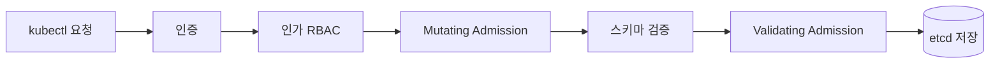

## 11. 애플리케이션 배포를 위한 고급 설정

지금까지는 파드를 "띄우는 것" 자체에 집중했다.
Deployment 로 파드를 늘리고, Service 와 Ingress 로 트래픽을 넘기고, 10 장에서는 RBAC 로 누가 무엇을 할 수 있는지까지 정했다.
그런데 정작 파드가 노드의 CPU 와 메모리를 얼마나 가져다 쓰는지는 한 번도 신경 쓰지 않았다.

책을 따라 실습할 때는 노드에 nginx 몇 개 띄우는 게 전부라 자원 걱정을 할 일이 없었다.
그런데 책에서는 실제 클러스터라면 여러 애플리케이션이 같은 노드를 나눠 쓰기 때문에, 파드 하나가 메모리를 무한정 먹기 시작하면 같은 노드의 다른 파드까지 영향을 받는다고 짚는다.
11 장은 이런 상황을 막기 위한 고급 설정들을 다루는데, 그중 11.1 은 **파드의 자원 사용량 제한**이다.
예제는 책의 [chapter11-1](https://github.com/alicek106/start-docker-kubernetes/tree/master/chapter11-1) 디렉토리에 있는 YAML 을 그대로 사용했다.

---

## 11.1 파드의 자원 사용량 제한

쿠버네티스에서 자원 제한은 크게 두 층위로 나뉜다.

| 층위 | 오브젝트 / 필드 | 무엇을 제한하는가 |
|---|---|---|
| 컨테이너 | `resources.limits`, `resources.requests` | 컨테이너 하나가 쓸 수 있는 CPU·메모리 |
| 네임스페이스 | `ResourceQuota` | 네임스페이스 전체가 쓸 수 있는 자원 총량, 오브젝트 개수 |
| 네임스페이스 | `LimitRange` | 네임스페이스 안 컨테이너·파드의 기본값과 최소·최대값 |

먼저 컨테이너 단위부터 보고, 그 다음 네임스페이스 단위로 넓혀가자.

---

### 11.1.1 컨테이너 파드와 자원 사용량 제한 : Limits

책의 앞부분에서 도커로 컨테이너 자원을 제한할 때는 `docker run` 에 옵션을 붙였다.

```shell
docker run -it --name memory_1gb --memory 1g ubuntu:22.04
docker run -it --name cpu_1_alloc --cpus 1 ubuntu:22.04
```

쿠버네티스는 이걸 파드 YAML 의 `resources.limits` 로 옮겨놓았다.

```yaml
## resource-limit-pod.yaml
apiVersion: v1
kind: Pod
metadata:
  name: resource-limit-pod
  labels:
    name: resource-limit-pod
spec:
  containers:
  - name: nginx
    image: nginx:latest
    resources:
      limits:
        memory: "256Mi"
        cpu: "1000m"
```

`memory: "256Mi"` 는 도커의 `--memory 256m` 과, `cpu: "1000m"` 은 `--cpus 1` 과 같은 의미다.
CPU 단위인 `m` 은 밀리코어(millicore)로, `1000m` 이 CPU 1 개에 해당한다.
`500m` 이면 CPU 0.5 개, `cpu: 0.5` 처럼 소수로 적어도 똑같이 동작한다.

파드를 생성한 뒤 파드가 배치된 노드의 정보를 확인해보면 이 값이 반영되어 있다.
(출력의 수치는 노드 사양에 따라 다르다.)

```shell
kubectl apply -f resource-limit-pod.yaml
kubectl get pods -o wide                # 파드가 어느 노드에 떴는지 확인
kubectl describe node <노드 이름>
```

```
Non-terminated Pods:          (5 in total)
  Namespace  Name                CPU Requests  CPU Limits  Memory Requests  Memory Limits
  ---------  ----                ------------  ----------  ---------------  -------------
  default    resource-limit-pod  1 (50%)       1 (50%)     256Mi (6%)       256Mi (6%)
  ...
Allocated resources:
  Resource           Requests     Limits
  --------           --------     ------
  cpu                1350m (67%)  1 (50%)
  memory             326Mi (8%)   426Mi (11%)
```

출력을 보다가 한 가지 의문점이 생겼다.
분명 YAML 에는 `limits` 만 적었는데, 출력에는 `Requests` 까지 같은 값으로 채워져 있다.
책을 더 읽어보니 `limits` 만 지정하면 쿠버네티스가 `requests` 를 `limits` 와 같은 값으로 자동 설정하기 때문이었다.

그렇다면 `requests` 는 대체 뭘 하는 값일까.

---

### 11.1.2 컨테이너 파드와 자원 사용량 제한하기 : Requests

`limits` 가 "이 이상은 절대 못 쓴다" 는 상한선이라면, `requests` 는 "최소한 이만큼은 보장해달라" 는 하한선이다.

```yaml
## resource-limit-with-request-pod.yaml
apiVersion: v1
kind: Pod
metadata:
  name: resource-limit-with-request-pod
  labels:
    name: resource-limit-with-request-pod
spec:
  containers:
  - name: nginx
    image: nginx:latest
    resources:
      limits:
        memory: "256Mi"
        cpu: "1000m"
      requests:
        memory: "128Mi"
        cpu: "500m"
```

이 파드는 메모리 128Mi, CPU 0.5 개를 보장받고, 여유가 있으면 최대 256Mi, CPU 1 개까지 쓸 수 있다.

처음 읽을 때는 "어차피 limits 만 있으면 충분하지 않나?" 싶었다.
그런데 책에서 이 개념이 필요한 이유로 드는 게 **오버커밋(Overcommit)** 이다.

모든 컨테이너가 항상 limits 만큼 자원을 쓰는 건 아니다.
평소에는 128Mi 정도만 쓰다가 트래픽이 몰릴 때만 잠깐 256Mi 를 쓰는 애플리케이션에 256Mi 를 통째로 예약해두면, 나머지 시간에는 그 자원이 놀게 된다.
그래서 쿠버네티스는 노드의 실제 용량보다 limits 합계가 더 커지는 것을 허용한다.
이게 오버커밋이고, 이때 기준이 되는 게 `requests` 다.

스케줄러는 파드를 어느 노드에 배치할지 결정할 때 **limits 가 아니라 requests 만 본다.**
노드에 남은 할당 가능 자원(Allocatable) 에서 이미 배치된 파드들의 requests 합을 빼고, 새 파드의 requests 가 들어갈 자리가 있으면 배치한다.

책의 예제 중에 limits 를 노드 메모리보다 크게 잡은 Deployment 가 있어서 이걸로 확인해봤다.

```yaml
## deployment-over-memory.yaml
apiVersion: apps/v1
kind: Deployment
metadata:
  name: deployment-over-memory
spec:
  selector:
    matchLabels:
      app: nginx
  template:
    metadata:
      name: nginx
      labels:
        app: nginx
    spec:
      containers:
      - name: nginx
        image: nginx
        resources:
          limits:
            memory: "3000Mi"
            cpu: "1000m"
          requests:
            memory: "128Mi"
            cpu: "500m"
```

limits 는 3000Mi 로 노드 메모리를 넘기지만, requests 가 128Mi 라서 파드는 아무렇지 않게 `Running` 상태가 된다.
반대로 requests 쪽을 노드의 할당 가능 자원보다 크게 바꿔서 적용하면 파드는 어느 노드에도 배치되지 못하고 `Pending` 에 머문다.

```shell
kubectl describe pod <파드 이름>
```

```
Events:
  Type     Reason            Age   From               Message
  ----     ------            ----  ----               -------
  Warning  FailedScheduling  10s   default-scheduler  0/3 nodes are available: 3 Insufficient memory.
```

정리하면 이렇다.

> `requests` 는 스케줄링과 자원 보장의 기준이고, `limits` 는 실제 사용량의 상한선이다.
> 둘 사이의 간격만큼 오버커밋이 일어난다.

다만 오버커밋은 공짜가 아니다.
모든 파드가 동시에 limits 까지 자원을 쓰려고 하면 노드는 약속을 지킬 수 없다.
이때 CPU 와 메모리는 전혀 다르게 반응하는데, 이 차이가 다음 두 절의 핵심이다.

---

### 11.1.3 CPU 자원 사용량의 제한 원리

CPU 는 **압축 가능한(compressible) 자원** 이다.
CPU 가 부족해도 프로세스를 죽일 필요가 없고, 그냥 덜 실행시키면(쓰로틀링) 된다.
조금 느려질 뿐 애플리케이션은 살아 있다.

쿠버네티스는 이걸 리눅스 cgroup 으로 구현한다.
`requests` 와 `limits` 는 각각 다른 cgroup 설정으로 바뀌는데, 책에서도 도커 옵션과 비교해서 설명하고 있어 이해가 쉬웠다.
책은 cgroup v1 기준으로 설명하는데, 최근 리눅스 배포판은 대부분 cgroup v2 를 쓰기 때문에 v2 의 이름도 함께 적어두었다.

| 쿠버네티스 | 도커 옵션 | cgroup v1 | cgroup v2 | 의미 |
|---|---|---|---|---|
| `requests.cpu` | `--cpu-shares` | `cpu.shares` | `cpu.weight` | CPU 가 경합할 때의 상대적 가중치 |
| `limits.cpu` | `--cpus` | `cpu.cfs_quota_us` / `cpu.cfs_period_us` | `cpu.max` | 일정 주기 동안 쓸 수 있는 CPU 시간의 상한 |

#### requests → cpu.shares

`requests.cpu` 는 CPU 1 개당 1024 의 `cpu.shares` 로 변환된다.
`500m` 이면 512, `1000m` 이면 1024 다.

이 값은 절대량이 아니라 **비율** 이다.
CPU 가 놀고 있으면 shares 와 관계없이 누구든 쓸 수 있고, 여러 컨테이너가 동시에 CPU 를 원할 때만 shares 비율대로 나눠 갖는다.
requests 가 500m 인 컨테이너와 1000m 인 컨테이너가 경합하면 1:2 비율로 CPU 시간을 받는 식이다.

스케줄러가 노드에 requests 합이 넘치지 않도록 배치해주기 때문에, 경합 상황에서도 각 컨테이너는 최소한 자신의 requests 만큼은 받게 된다.
"최소 보장" 이 실제로 성립하는 이유가 여기에 있다.

#### limits → CFS quota

`limits.cpu` 는 CFS(Completely Fair Scheduler) 의 quota 로 변환된다.
기본 주기(`cfs_period_us`) 는 100ms(100000us) 이고, `limits.cpu: 1000m` 이면 quota 가 100000us, `500m` 이면 50000us 가 된다.
즉 "100ms 마다 최대 50ms 만큼만 CPU 를 쓸 수 있다" 는 뜻이다.

이 값은 노드의 cgroup 파일에 그대로 기록된다.
cgroup v2 라면 `cpu.max` 파일에 `quota period` 형태로 들어가는데, `limits.cpu: 1000m` 이면 `100000 100000` 이 된다.
(경로는 컨테이너 런타임과 cgroup 드라이버에 따라 다르므로 여기서는 생략했다.)

quota 를 다 써버린 컨테이너는 다음 주기가 올 때까지 멈춘다.
이게 CPU 쓰로틀링이고, 애플리케이션 입장에서는 응답이 갑자기 느려지는 것으로 나타난다.

CPU 는 이렇게 "느려지는" 것으로 끝나지만, 메모리는 이야기가 다르다.

---

### 11.1.4 QoS 클래스와 메모리 자원 사용량 제한 원리

메모리는 **압축 불가능한(incompressible) 자원** 이다.
이미 할당해준 메모리를 "조금 천천히 쓰라" 고 할 방법이 없다.
그래서 메모리가 부족해지면 누군가는 죽어야 한다.

죽는 경로는 두 가지다.

1. **컨테이너가 자신의 `limits.memory` 를 넘긴 경우** — 커널의 OOM Killer 가 해당 컨테이너 프로세스를 즉시 종료한다. 파드 상태에 `OOMKilled` 가 찍히고, `restartPolicy` 에 따라 재시작된다.
2. **노드 전체의 메모리가 부족해진 경우** — 오버커밋 때문에 limits 를 지키고 있어도 노드 메모리가 바닥날 수 있다. 이때 kubelet 이 `MemoryPressure` 상태를 감지하고 파드를 축출(Eviction)한다.

두 번째 경우가 문제다.
노드 위에 파드가 여러 개 있는데 그중 누구를 먼저 내쫓아야 할까.
이 우선순위를 정하는 게 **QoS(Quality of Service) 클래스** 다.

| QoS 클래스 | 조건 | 축출 우선순위 | `oom_score_adj` |
|---|---|---|---|
| `Guaranteed` | 모든 컨테이너가 CPU·메모리 requests 와 limits 를 가지고, 둘이 같다 | 가장 마지막 | -997 |
| `Burstable` | Guaranteed 는 아니지만 하나 이상의 컨테이너에 requests 또는 limits 가 있다 | 중간 | 2 ~ 999 |
| `BestEffort` | 어떤 컨테이너에도 requests·limits 가 없다 | 가장 먼저 | 1000 |

QoS 클래스는 사용자가 직접 지정하는 값이 아니다.
requests 와 limits 를 어떻게 적었느냐에 따라 쿠버네티스가 자동으로 결정한다.

#### Guaranteed

```yaml
## resource-limit-pod-guaranteed.yaml
spec:
  containers:
  - name: nginx
    image: nginx:latest
    resources:
      limits:
        memory: "256Mi"
        cpu: "1000m"
      requests:
        memory: "256Mi"
        cpu: "1000m"
```

```shell
kubectl get pod resource-limit-pod-guaranteed -o yaml | grep qosClass
##   qosClass: Guaranteed
```

requests 와 limits 가 같으니 오버커밋이 전혀 없다.
약속한 자원을 넘어서 쓸 일이 없기 때문에 노드 메모리가 부족해져도 가장 마지막까지 살아남는다.

그런데 11.1.1 에서 만든 `resource-limit-pod` 도 같은 방법으로 확인해보니 결과가 조금 의외였다.

```shell
kubectl get pod resource-limit-pod -o yaml | grep qosClass
##   qosClass: Guaranteed
```

limits 만 적었을 뿐인데 Guaranteed 다.
앞에서 봤듯 limits 만 지정하면 requests 가 같은 값으로 자동 설정되기 때문이다.
결국 "requests == limits" 조건을 만족하게 되는 셈이라, Guaranteed 를 노린다면 limits 만 적어도 충분하다.

#### BestEffort

```yaml
## nginx-besteffort-pod.yaml
apiVersion: v1
kind: Pod
metadata:
  name: nginx-besteffort-pod
spec:
  containers:
  - name: nginx-besteffort-pod
    image: nginx:latest
```

10 장까지 책을 따라 만든 파드는 거의 다 이 형태였다.
아무것도 지정하지 않았으니 노드에 남은 자원은 얼마든지 가져다 쓸 수 있지만, 반대로 어떤 자원도 보장받지 못하고 메모리가 부족해지면 가장 먼저 축출 대상이 된다.
그동안 실습한 파드들이 전부 "가장 먼저 죽는" 등급이었다는 걸 이 절을 읽으면서 처음 알았다.

#### Burstable

`resource-limit-with-request-pod` 처럼 requests 가 limits 보다 작거나, 일부 컨테이너에만 자원 설정이 있는 경우가 Burstable 이다.
평소엔 requests 만큼 쓰다가 여유가 있으면 limits 까지 치고 올라갈(burst) 수 있다는 의미다.

Burstable 끼리 경쟁할 때는 **requests 대비 실제 사용량이 큰 파드** 가 먼저 축출된다.
책의 범위를 조금 벗어나지만, 공식 문서를 보면 Burstable 의 `oom_score_adj` 는 `1000 - (1000 × 메모리 requests / 노드 메모리 용량)` 으로 계산된다.
requests 를 작게 잡을수록 OOM Killer 의 눈에 더 잘 띈다는 뜻이다.

> CPU 가 부족하면 느려지고, 메모리가 부족하면 죽는다.
> 누가 먼저 죽을지는 requests·limits 설정으로 결정되는 QoS 클래스가 정한다.

---

### 11.1.5 ResourceQuota 와 LimitRange

지금까지는 컨테이너 하나하나의 자원을 제한했다.
그런데 7 장에서 다뤘듯 클러스터는 네임스페이스로 팀이나 환경을 나눠 쓰는 경우가 많다.
이때 한 네임스페이스가 클러스터 자원을 혼자 다 써버리면 다른 네임스페이스에서는 파드를 띄울 수조차 없게 된다.
파드를 여러 개 만들어버리면 그만이기 때문에, 컨테이너 단위 제한만으로는 이 문제를 막을 수 없다.

#### ResourceQuota

`ResourceQuota` 는 네임스페이스 전체가 쓸 수 있는 자원의 총량을 제한한다.

```yaml
## resource-quota.yaml
apiVersion: v1
kind: ResourceQuota
metadata:
  name: resource-quota-example
  namespace: default
spec:
  hard:
    requests.cpu: "1000m"
    requests.memory: "500Mi"
    limits.cpu: "1500m"
    limits.memory: "1000Mi"
```

```shell
kubectl apply -f resource-quota.yaml
kubectl describe quota
```

```
Name:            resource-quota-example
Namespace:       default
Resource         Used   Hard
--------         ----   ----
limits.cpu       0      1500m
limits.memory    0      1000Mi
requests.cpu     0      1000m
requests.memory  0      500Mi
```

이제 default 네임스페이스 안 모든 파드의 requests·limits 합이 이 값을 넘을 수 없다.
앞에서 만든 `deployment-over-memory` 를 다시 배포해보면 limits.memory 가 3000Mi 라 쿼터를 넘긴다.

그런데 실습해보면 `kubectl apply` 는 에러 없이 성공한다.
쿼터가 안 걸린 건가 싶었는데, 파드 목록을 보면 파드가 하나도 생성되지 않았다.

```shell
kubectl get pods                       # 아무것도 없음
kubectl describe rs <레플리카셋 이름>
```

```
Events:
  Warning  FailedCreate  5s  replicaset-controller  Error creating: pods "deployment-over-memory-xxx" is forbidden:
  exceeded quota: resource-quota-example, requested: limits.memory=3000Mi, used: limits.memory=0, limited: limits.memory=1000Mi
```

Deployment 오브젝트 자체는 쿼터와 관계없이 생성되고, 실제로 파드를 만드는 건 ReplicaSet 이기 때문이다.
에러는 ReplicaSet 의 이벤트에 숨어 있다.
파드를 직접 만들었다면 `kubectl apply` 시점에 바로 `Forbidden` 이 떨어졌을 것이다.

여기에 더해 주의할 점이 하나 더 있다.
CPU·메모리 쿼터가 걸린 네임스페이스에서는 **requests·limits 를 지정하지 않은 파드를 아예 만들 수 없다.**
쿼터를 계산하려면 각 파드의 자원량을 알아야 하는데, BestEffort 파드는 그 값이 없기 때문이다.

```shell
kubectl run nginx --image nginx
## Error from server (Forbidden): pods "nginx" is forbidden: failed quota: resource-quota-example:
## must specify limits.cpu for: nginx; limits.memory for: nginx; requests.cpu for: nginx; requests.memory for: nginx
```

ResourceQuota 는 자원뿐 아니라 오브젝트 개수도 제한할 수 있다.

```yaml
## quota-limit-pod-svc.yaml
spec:
  hard:
    requests.cpu: "1000m"
    requests.memory: "500Mi"
    limits.cpu: "1500m"
    limits.memory: "1000Mi"
    count/pods: 3
    count/services: 5
```

`count/<리소스>` 형식으로 파드, 서비스, 시크릿, 컨피그맵, PVC, 디플로이먼트 등 대부분의 오브젝트 개수에 상한을 걸 수 있다.
`count/deployments.apps` 처럼 코어 API 그룹이 아닌 리소스는 그룹명까지 붙인다.

`scopes` 를 쓰면 특정 조건의 파드에만 쿼터를 적용할 수도 있다.

```yaml
## quota-limit-besteffort.yaml
apiVersion: v1
kind: ResourceQuota
metadata:
  name: besteffort-quota
  namespace: default
spec:
  hard:
    count/pods: 1
  scopes:
    - BestEffort
```

BestEffort 파드는 딱 1 개까지만 허용한다는 뜻이다.
`scopes` 에는 `BestEffort`, `NotBestEffort`, `Terminating`, `NotTerminating` 등을 지정할 수 있다.
BestEffort 스코프는 자원을 제한할 수 없으니(애초에 자원 설정이 없으니까) `count/pods` 와 함께 쓴다.

#### LimitRange

ResourceQuota 를 걸면 모든 파드에 requests·limits 를 적어야 한다.
실습하면서도 느꼈지만 매번 YAML 에 자원 설정을 붙이는 건 꽤 번거롭고, 하나라도 빼먹으면 위의 에러가 난다.
거기다 쿼터는 총량만 볼 뿐이라 파드 하나가 네임스페이스 쿼터를 통째로 차지하는 것도 막지 못한다.

`LimitRange` 는 이 빈틈을 메운다.
네임스페이스 안 컨테이너·파드에 **기본값** 을 자동으로 넣어주고, 개별 자원량의 **최소·최대** 를 강제한다.

```yaml
## limitrange-example.yaml
apiVersion: v1
kind: LimitRange
metadata:
  name: mem-limit-range
spec:
  limits:
  - default:                # 1. 자동으로 설정될 기본 Limit 값
      memory: 256Mi
      cpu: 200m
    defaultRequest:         # 2. 자동으로 설정될 기본 Request 값
      memory: 128Mi
      cpu: 100m
    max:                    # 3. 자원 할당량의 최대값
      memory: 1Gi
      cpu: 1000m
    min:                    # 4. 자원 할당량의 최소값
      memory: 16Mi
      cpu: 50m
    type: Container         # 5. 각 컨테이너에 대해서 적용
```

자원 설정 없이 파드를 만들어보면 LimitRange 가 끼워 넣은 값이 보인다.

```shell
kubectl apply -f limitrange-example.yaml
kubectl run nginx-limitrange --image nginx
kubectl get pod nginx-limitrange -o yaml | grep -A 6 resources
```

```yaml
    resources:
      limits:
        cpu: 200m
        memory: 256Mi
      requests:
        cpu: 100m
        memory: 128Mi
```

YAML 에는 한 줄도 적지 않았는데 `default` 와 `defaultRequest` 값이 그대로 들어가 있다.
반대로 `max` 를 넘기거나 `min` 보다 작은 값을 직접 지정하면 파드 생성이 거부된다.

`type: Pod` 로 지정하면 파드 안 모든 컨테이너의 합계를 기준으로 제한한다.

```yaml
## limitrange-example-pod.yaml
spec:
  limits:
  - max:
      memory: 1Gi
    min:
      memory: 200Mi
    type: Pod
```

마지막으로 `maxLimitRequestRatio` 는 requests 대비 limits 의 비율 상한을 정한다.

```yaml
## limitrange-ratio.yaml
spec:
  limits:
  - maxLimitRequestRatio:
      memory: 1.5
      cpu: 1
    type: Container
```

메모리 limits 는 requests 의 1.5 배까지만, CPU 는 반드시 requests 와 limits 가 같아야 한다는 뜻이다.
11.1.2 에서 본 오버커밋의 폭을 네임스페이스 수준에서 통제하는 장치라고 보면 된다.

> ResourceQuota 는 네임스페이스의 "총량" 을, LimitRange 는 그 안 컨테이너 하나하나의 "기본값과 범위" 를 정한다.
> 둘은 함께 써야 빈틈이 없다.

---

### 11.1.6 ResourceQuota 와 LimitRange 의 원리 : Admission Controller

LimitRange 실습을 하면서 든 생각은 "내가 보낸 YAML 을 누가 중간에 고친 거지?" 였다.
`kubectl apply` 로 보낸 파드 명세에는 resources 가 없었는데, etcd 에 저장된 파드에는 들어가 있다.
요청이 API 서버에 도착한 뒤 저장되기 전 어딘가에서 내용이 바뀐 것이다.

10 장에서 API 요청이 인증 → 인가 → 어드미션 컨트롤 순서로 처리된다고 정리했었다.
그때는 세 번째 단계를 "내용은 문제없어?" 정도로만 넘어갔는데, 책에서는 바로 그 단계가 ResourceQuota 와 LimitRange 의 동작 원리라고 설명한다.



**Admission Controller** 는 인증·인가를 통과한 요청을 etcd 에 저장하기 직전에 가로채는 플러그인이다.
역할에 따라 두 종류로 나뉜다.

| 종류 | 하는 일 | 예시 |
|---|---|---|
| Mutating | 요청 내용을 **변형** 한다 | `LimitRanger` 가 기본 requests·limits 를 채워 넣음, `ServiceAccount` 가 기본 SA 를 붙임 |
| Validating | 요청 내용을 **검증** 하고 거부할 수 있다 | `ResourceQuota` 가 쿼터 초과 요청을 거부함 |

`LimitRanger` 는 두 역할을 다 한다.
Mutating 단계에서 기본값을 채우고, Validating 단계에서 min·max·ratio 를 검사한다.
`ResourceQuota` 는 Validating 단계에서 현재 사용량과 새 요청을 더해 쿼터를 넘는지 확인하는 역할만 한다.

순서가 Mutating → Validating 인 이유도 여기서 납득이 된다.
LimitRanger 가 기본값을 먼저 채워 넣어야 ResourceQuota 가 그 값으로 쿼터를 계산할 수 있다.
순서가 반대였다면 자원 설정이 없는 파드는 앞에서 본 `must specify limits.cpu` 에러로 전부 거부됐을 것이다.
LimitRange 와 ResourceQuota 를 "함께 써야 빈틈이 없다" 고 한 게 이런 의미였다.

어떤 Admission Controller 를 켤지는 `kube-apiserver` 의 실행 옵션으로 정해진다.
책처럼 kubeadm 으로 설치한 클러스터라면 마스터 노드의 static pod 매니페스트에서 확인할 수 있다.

```shell
## 마스터 노드에서 실행
grep admission /etc/kubernetes/manifests/kube-apiserver.yaml
##     - --enable-admission-plugins=NodeRestriction
```

`NodeRestriction` 하나만 보여서 LimitRanger 나 ResourceQuota 가 꺼져 있는 건가 싶었는데, 그렇지 않다.
`--enable-admission-plugins` 는 **기본 활성화 목록에 추가로** 켤 플러그인을 적는 옵션이고, `LimitRanger`, `ResourceQuota`, `ServiceAccount`, `DefaultStorageClass` 같은 플러그인은 원래부터 기본으로 켜져 있다.

내장 플러그인 말고 직접 만든 로직을 끼워 넣을 수도 있다.
`MutatingAdmissionWebhook` 과 `ValidatingAdmissionWebhook` 을 쓰면 어드미션 단계에서 외부 웹훅 서버를 호출하게 할 수 있다.
Istio 가 파드를 생성할 때 사이드카 컨테이너를 자동으로 주입하는 것도 이 Mutating 웹훅 덕분이다.
책 이후에 나온 기능이라 덧붙이자면, 1.30 부터는 웹훅 서버 없이 CEL 표현식만으로 검증 규칙을 정의하는 `ValidatingAdmissionPolicy` 도 GA 가 됐다.

> ResourceQuota 와 LimitRange 는 그 자체로 동작하는 게 아니라, 오브젝트가 etcd 에 저장되기 직전
> Admission Controller 가 그 오브젝트를 읽어 요청을 고치거나 거부하는 방식으로 동작한다.

---

## 마치며

책을 따라오는 동안 `resources` 필드는 "적어두면 좋은 옵션" 정도로만 생각해왔다.
실습에서는 안 적어도 잘 돌아갔기 때문이다.

그런데 이번 절을 읽고 실습해보니 requests 는 스케줄러가 노드를 고르는 기준이자 cgroup 의 CPU 가중치였고, requests 와 limits 를 어떻게 적느냐에 따라 노드 메모리가 부족할 때 누가 먼저 죽을지까지 정해지고 있었다.
아무것도 안 적은 파드가 "가장 먼저 죽는" BestEffort 등급이라는 걸 알고 나니, 그동안 만들었던 실습 YAML 들이 조금 다르게 보인다.

LimitRange 가 내 YAML 을 몰래 고쳐놓는 걸 보고 시작한 의문이 결국 10 장의 Admission Control 로 이어졌다는 것도 재미있었다.
다음 11.2 에서는 이어서 파드의 스케줄링을 다룰 예정이다.
