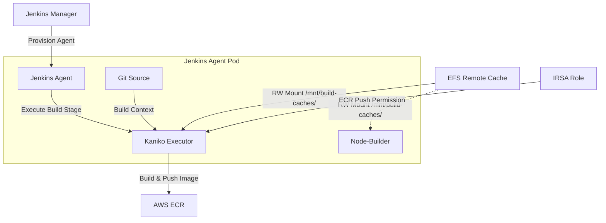

## 배경: 빌드 시스템이 Kubernetes로 넘어갔다

회사의 빌드 시스템은 한동안 EC2 SPOT 인스턴스 위에서 돌아갔다.
그 시절(구 버전 파이프라인이라 부르던)엔 빌드가 EC2 위에서 직접 실행됐고, Turbo Remote Cache 역시 API Token + HTTPS 기반의 공식 스펙을 구현한 HTTP 서버를 Docker로 별도 운영하면서 도메인으로 참조하는 구조였다.
(당시 팀에서 구축해둔 Remote Server가 있었는데, 현재는 서버가 내려간 상태라고 한다)

다만 문제가 하나 있었는데, SPOT 인스턴스는 Budget 상한선이 인스턴스 비용보다 낮아지는 순간 빌드를 뺏겨 버린다는 점이다.
이 때문에 빌드 프로세스가 종종 잘 돌아가다 강제로 종료되는 일이 번번이 일어났고, 이걸 겪은 입장으로서 솔직히 꽤 짜증스러웠다.

그러다 2026년 5월 빌드 시스템이 Kubernetes로 이전되면서 빌드가 Pod 단위로 격리되는 구조로 바뀌었고, 덕분에 SPOT 회수로 빌드가 중단될 일은 더 이상 없어졌다.
그런데 이 이전이 단순히 실행 환경만 바꾼 게 아니라, Turbo Cache 전략 자체도 처음부터 다시 생각하게 만들었다.

---

## Remote Server를 그대로 쓰지 않은 이유

K8s로 넘어온 다음 Remote Cache를 어떻게 구성할지를 다시 생각해야 했는데, 가장 단순한 선택지는 기존처럼 HTTP Cache 서버를 구성하는 것이었다.
Turbo 공식 스펙을 구현한 서버를 Deployment로 올리면 되는, 구조적으로는 이전 방식과 크게 다르지 않은 접근이다.

그런데 K8s 환경에서 여러 빌드 파드가 공유 스토리지에 접근하는 가장 자연스러운 방법은 PVC(PersistentVolumeClaim)이고, HTTP 서버를 별도로 운영한다는 건 그 패턴 대신 Deployment, Service, 도메인, TLS 인증서까지 직접 관리하겠다는 뜻이었다.
파드들이 공유해야 하는 건 결국 파일인데, 그걸 굳이 HTTP로 주고받는 구조를 K8s 위에 새로 올릴 이유가 없었다.

AWS EFS(Elastic File System)를 PVC로 마운트하면 그 복잡함이 전부 사라지는데, PVC 하나를 붙이는 것만으로 모든 빌드 파드가 동일한 캐시 디렉토리를 공유하고 서버 인프라는 AWS가 관리해준다.
성능 면에서도 이게 유리한데, HTTP Remote Cache는 캐시 파일을 업로드/다운로드할 때마다 HTTP 요청이 발생하지만 EFS 마운트는 **파일시스템 I/O**로 동작하기 때문에 Cache Hit 시 오버헤드가 최소화된다.

---

## 처음엔 환경변수로 캐시 경로를 바꾸면 될 줄 알았다

Turbo는 `TURBO_CACHE_DIR` 환경변수로 캐시 디렉토리를 지정할 수 있어서, 처음엔 이걸로 EFS 경로를 넘기면 끝날 줄 알았다.

```dockerfile
# 동작 안 함
ENV TURBO_CACHE_DIR=/mnt/build-caches/app/.turbo
```

실제로 돌려보니 Turbo가 EFS 캐시를 전혀 읽지 못했다.
정확한 원인을 특정하기는 어려웠는데, 가장 유력한 이유는 두 가지다.
`TURBO_CACHE_DIR`로 지정한 경로에 디렉토리가 미리 존재하지 않으면 Turbo가 해당 경로를 캐시 저장소로 인식하지 못하는 경우이거나, Kaniko의 파일시스템 스냅샷 방식과 EFS 볼륨 마운트의 조합이 충돌하는 경우다.

결국 `.turbo` 디렉토리 자체를 EFS 경로로 **심볼릭 링크**를 걸어주는 방식으로 우회했다.

```dockerfile
# 정상 동작
RUN rm -rf /app/.turbo && ln -sf /mnt/build-caches/app/.turbo /app/.turbo
```

이 방식이 동작하는 이유는, Turbo 입장에서 캐시 경로가 여전히 `/app/.turbo`이기 때문이다.
심볼릭 링크는 파일시스템 수준에서 투명하게 EFS를 가리키고 있어서, Turbo는 아무것도 바뀐 게 없다고 인식한 채로 EFS를 읽고 쓰게 된다.
`TURBO_CACHE_DIR`로 경로를 직접 바꾸는 방식과 달리, Turbo의 기본 경로 탐색 로직 자체를 건드리지 않는다는 게 핵심이다.

다만 공식 환경변수가 아닌 우회 방식이기 때문에 Turbo 버전 업그레이드나 Dockerfile 구조 변경 시 캐시 연결이 조용히 끊길 수 있다는 게 트레이드오프로 남아 있다.
변경이 생길 때마다 캐시 동작 여부를 별도로 검증해야 한다. (아쉽지만...)

---

## EFS 마운트 기반 캐시가 동작하는 구조

심볼릭 링크로 EFS를 연결한 뒤, 전체 파이프라인 구조를 그리면 이렇다.



Jenkins Manager가 빌드 요청을 받으면 Jenkins Agent Pod를 프로비저닝하고, Karpenter가 파드가 실행될 노드를 자동으로 프로비저닝한다.
파드 안에는 세 컨테이너가 들어가는데, **JenkinsAgent**는 Jenkins Manager와 통신하며 빌드 생성/중지/삭제를 조율하고, **Kaniko**가 실질적인 이미지 빌드를 담당한다.
모듈 수가 매우 많은 서비스의 경우엔 **Node-Builder**가 추가로 올라온다. (다이어그램에서 점선으로 표시)

파드가 시작되면 두 컨테이너에 EFS가 `/mnt/build-caches/` 경로로 마운트되고, 이후 Kaniko 빌드 시점에 `turbo.json`의 inputs 기준으로 현재 모듈의 해시를 계산한다.
EFS에 동일한 해시가 있으면 **FULL TURBO** — 빌드를 건너뛰고 캐시 결과물을 재사용하고, 해시가 없으면 **NO TURBO** — 전체 빌드를 실행한 뒤 새 캐시를 EFS에 저장하고 나서 이미지를 AWS ECR에 푸시한다.

---

## Docker 레이어 캐싱과 Turbo Cache가 함께 동작하는 방식

Turbo Cache와 Docker 레이어 캐싱은 **동작하는 레벨이 다르기 때문에** 충돌 없이 공존하며 서로를 보완한다.

```
Docker Build (Kaniko)
│
├── Layer: FROM node:18                                              ← Docker 레이어 캐싱
├── Layer: COPY package.json .                                       ← Docker 레이어 캐싱
├── Layer: RUN pnpm install                                          ← 의존성 변경 없으면 스킵
├── Layer: RUN ln -sf /mnt/build-caches/app/.turbo /app/.turbo      ← EFS 심볼릭 링크 설정
├── Layer: COPY . .                                                  ← 소스 변경 시 캐시 미스 (이후 레이어 전부 무효화)
│
└── Layer: RUN pnpm turbo run build:prod        ← 여기서 Turbo Cache 동작
         │
         ├── 패키지 A 해시 일치 → FULL TURBO (EFS에서 캐시 복원, 빌드 스킵)
         └── 패키지 B 해시 불일치 → NO TURBO (빌드 실행 후 EFS에 저장)
```

Docker 레이어 캐싱은 `COPY . .` 레이어가 무효화되는 순간 이후 레이어를 전부 재실행하기 때문에, 소스 코드가 조금이라도 바뀌면 `pnpm turbo run build:prod` 레이어도 함께 캐시 미스가 난다.

그런데 이 지점에서 Turbo Cache가 동작하는데, Docker 레이어 캐시가 미스가 났더라도 Turbo는 모듈별로 입력 해시를 비교해 **변경되지 않은 모듈의 빌드를 개별적으로 스킵**한다.
레이어 캐싱은 Dockerfile 레벨의 거친 캐싱이고, Turbo Cache는 모듈 레벨의 세밀한 캐싱인 셈이다.

구체적인 시나리오로 보면 더 명확한데, 예를 들어 패키지 하나만 수정된 경우를 보자.

| 단계 | 동작 |
|---|---|
| `FROM`, `RUN pnpm install` 레이어 | Docker 레이어 캐시 **히트** → 스킵 |
| `COPY . .` 레이어 | 소스 변경 → 캐시 **미스**, 이후 레이어 전부 재실행 |
| `pnpm turbo run build:prod` | Docker 레이어 캐시 미스지만 Turbo가 모듈별 해시 확인 |
| └ 미변경 모듈들 | Turbo Cache **히트** (EFS) → 빌드 스킵 |
| └ 변경된 모듈 | Turbo Cache **미스** → 빌드 실행 후 EFS에 저장 |

두 캐싱이 함께 동작할 때 빌드 시간을 가장 효과적으로 줄일 수 있는 이유가 여기에 있다.

---

## 구 버전 vs 신 버전 파이프라인: 실제로 얼마나 달라졌나

| 항목 | 구 버전 파이프라인 (인스턴스 기반) | 신 버전 파이프라인 (K8s 기반) |
|---|---|---|
| 실행 환경 | EC2 SPOT 인스턴스 | Kubernetes Pod (Kaniko) |
| 캐시 방식 | 컨테이너 레이어 캐시 (인스턴스 로컬) | EFS Turbo Cache (공유, 영속) |
| 캐시 지속성 | 인스턴스가 살아있을 때만 유지 | 영속적, 모든 빌드 파드 공유 |
| SPOT 중단 위험 | 인스턴스 회수 시 빌드 중단 | 없음 |
| Kaniko 스냅샷 오버헤드 | 없음 | 있음 (redo 모드) |
| Full Turbo 기준 속도 | 인스턴스 운에 의존 | 일관되게 빠름 |

그간 구 버전 파이프라인이 빠르게 느껴졌던 건 사실 운이었는데, 동일한 SPOT 인스턴스에 이전 빌드의 컨테이너 레이어가 남아있던 경우에만 캐시가 동작했고 인스턴스가 교체되면 캐시 자체가 사라졌다.
SPOT 회수 시 빌드가 중단되는 문제도 있었으니 그게 딱히 좋은 환경은 아니었다. (은근 짜증났다는 건 앞서 말했지만)

신 버전 파이프라인은 Kaniko 내 파일 시스템 기반 스냅샷 오버헤드(redo 모드)가 있어서, 이미지 크기와 변경된 파일 수에 따라 No Turbo 빌드는 구 버전보다 느릴 수 있다.
반면 캐시가 EFS에 영속적으로 유지되기 때문에 Full Turbo 상태에서는 더 빠르고 안정적이다.
대부분의 빌드는 Full Turbo 상태로 돌아가기 때문에 실질적으로는 더 빠른 경우가 많다.

Kaniko Snapshot 모드에 대해 간단히 짚자면, `time → redo → full` 순으로 빠르지만 `time` 모드는 공식 문서에서 변경사항을 반영하지 못할 가능성이 높다고 명시되어 있어서 `redo` 모드가 속도와 정확성의 균형점으로 현재 채택된 방식이다.

---

## 완벽한 선택은 아니다 — EFS 캐싱의 한계

사실 AWS EFS의 가장 큰 부담은 뭐니뭐니 해도 비용인데, EFS는 GB당 ~$0.30/월인 반면 S3는 ~$0.023/월 수준으로 약 13배 차이가 난다.
캐시 파일이 쌓일수록 비용이 비례해서 올라가는 구조라 SRE 팀에서도 EFS → S3 전환을 검토 중이다.

여기에 더해, EFS에도 Lifecycle Policy가 있어 일정 기간 접근하지 않은 파일을 IA(Infrequent Access) 스토리지 클래스로 이동시킬 수는 있지만 자동으로 삭제되지는 않는다.
S3의 Lifecycle 정책처럼 기간 만료 후 완전 삭제가 되지 않기 때문에, 사용되지 않는 캐시가 스토리지를 계속 점유하게 되어 주기적으로 수동 정리를 해줘야 한다.

동시 빌드가 많아질수록 I/O 병목도 생기는데, EFS Bursting Throughput 모드는 저장된 데이터 크기에 비례해 처리량이 스케일되기 때문에 빌드 파드가 동시에 여러 개 뜨면 EFS I/O가 제한 요소가 될 수 있다.
Provisioned Throughput 모드로 전환하면 해소되지만 추가 비용이 붙는다.

앞서 언급한 심볼릭 링크 방식도 한계로 남아 있어서, `TURBO_CACHE_DIR` 환경변수가 동작하지 않아 우회책을 쓰는 만큼 Turbo 버전 업그레이드 시 캐시 연결이 끊길 가능성이 있다.

EFS는 특정 AWS 리전에도 종속되기 때문에, 멀티 리전 빌드 환경으로 확장할 경우 리전별로 별도 EFS를 운영해야 하는데 S3는 Cross-Region Replication이 가능해 이 측면에서는 S3가 더 유리하다.

세 가지 방식을 놓고 비교하면 이렇다.

| 항목 | EFS 마운트 | HTTP Remote Cache 서버 | S3 |
|---|---|---|---|
| 구축 복잡도 | 낮음 | 높음 | 중간 |
| K8s 친화성 | 높음 | 중간 | 중간 |
| 비용 효율 | 낮음 | 중간 | 높음 |
| 캐시 만료 관리 | 수동 | 서버 구현 필요 | Lifecycle 정책 |
| 멀티 리전 | 별도 EFS 필요 | 도메인 라우팅 | Cross-Region Replication |

지금은 EFS 기반으로 안정적으로 돌아가고 있고, 빌드 규모가 커지는 시점에 S3 전환을 본격 검토하게 될 것 같다.
